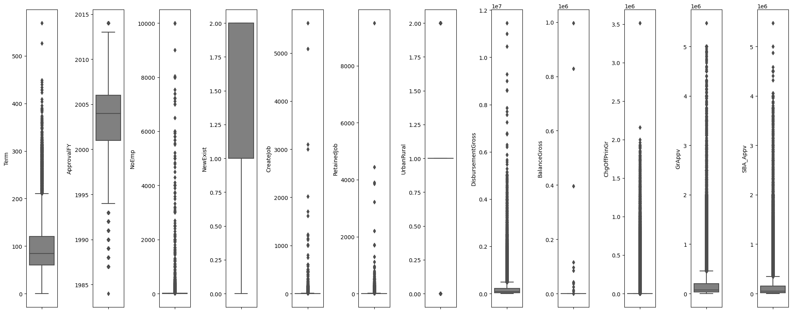
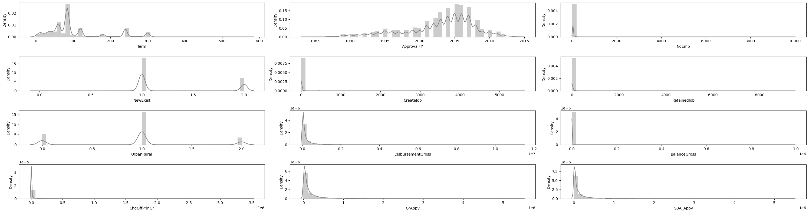
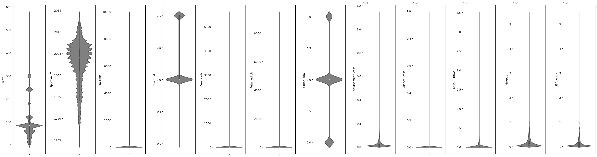
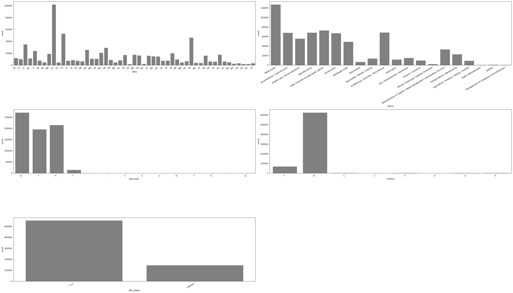
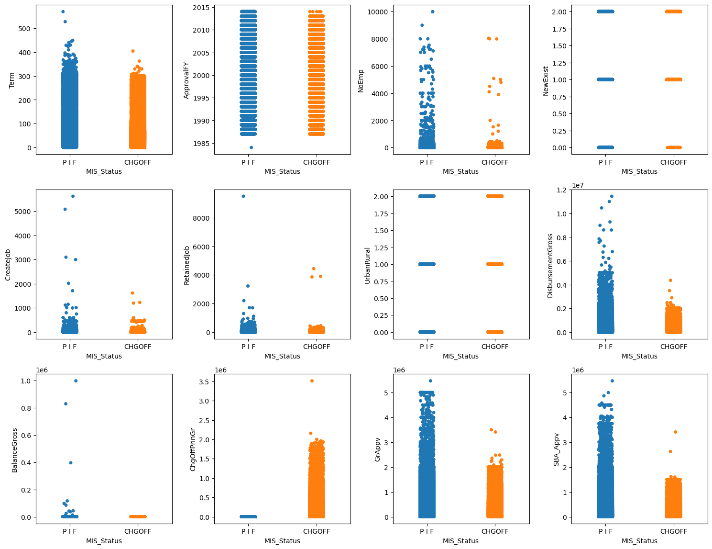
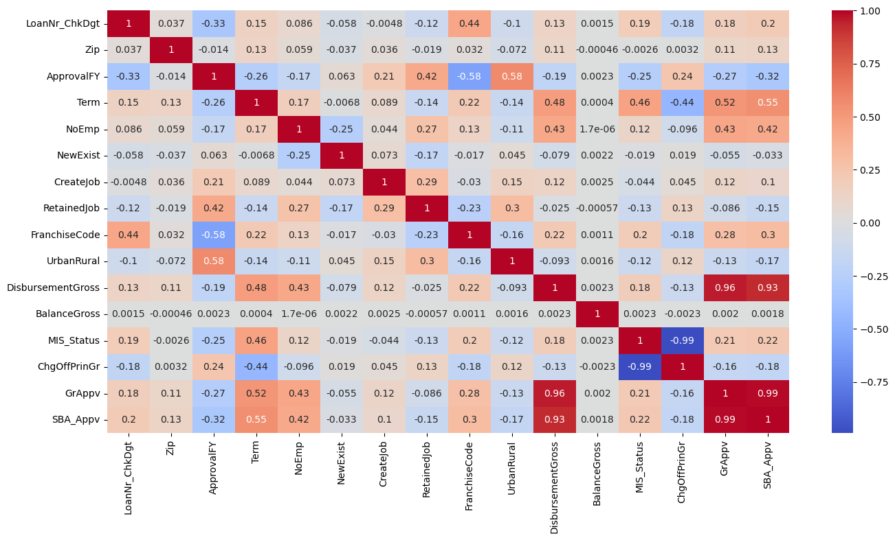
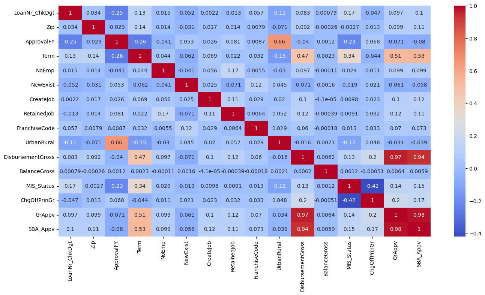
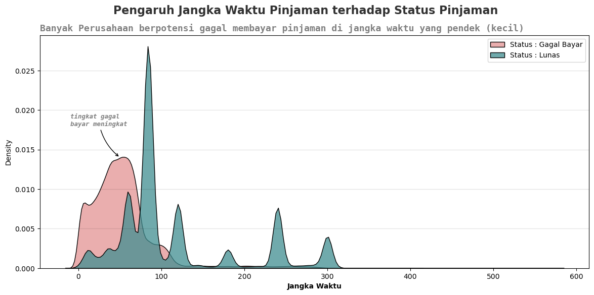

```python
import numpy as np
import pandas as pd
import matplotlib.pyplot as plt
import plotly.express as px
import plotly.graph_objects as go
import seaborn as sns
import warnings
warnings.filterwarnings('ignore')
```


```python
#read data & ubah convert ke datetime
df = pd.read_csv("SBAnational.csv", parse_dates=['ApprovalDate', 'DisbursementDate'])
df.head()
```


<div>
<style scoped>
    .dataframe tbody tr th:only-of-type {
        vertical-align: middle;
    }

    .dataframe tbody tr th {
        vertical-align: top;
    }

    .dataframe thead th {
        text-align: right;
    }
</style>
<table border="1" class="dataframe">
  <thead>
    <tr style="text-align: right;">
      <th></th>
      <th>LoanNr_ChkDgt</th>
      <th>Name</th>
      <th>City</th>
      <th>State</th>
      <th>Zip</th>
      <th>Bank</th>
      <th>BankState</th>
      <th>NAICS</th>
      <th>ApprovalDate</th>
      <th>ApprovalFY</th>
      <th>Term</th>
      <th>NoEmp</th>
      <th>NewExist</th>
      <th>CreateJob</th>
      <th>RetainedJob</th>
      <th>FranchiseCode</th>
      <th>UrbanRural</th>
      <th>RevLineCr</th>
      <th>LowDoc</th>
      <th>ChgOffDate</th>
      <th>DisbursementDate</th>
      <th>DisbursementGross</th>
      <th>BalanceGross</th>
      <th>MIS_Status</th>
      <th>ChgOffPrinGr</th>
      <th>GrAppv</th>
      <th>SBA_Appv</th>
    </tr>
  </thead>
  <tbody>
    <tr>
      <th>0</th>
      <td>1000014003</td>
      <td>ABC HOBBYCRAFT</td>
      <td>EVANSVILLE</td>
      <td>IN</td>
      <td>47711</td>
      <td>FIFTH THIRD BANK</td>
      <td>OH</td>
      <td>451120</td>
      <td>1997-02-28</td>
      <td>1997</td>
      <td>84</td>
      <td>4</td>
      <td>2.0</td>
      <td>0</td>
      <td>0</td>
      <td>1</td>
      <td>0</td>
      <td>N</td>
      <td>Y</td>
      <td>NaN</td>
      <td>1999-02-28</td>
      <td>$60,000.00</td>
      <td>$0.00</td>
      <td>P I F</td>
      <td>$0.00</td>
      <td>$60,000.00</td>
      <td>$48,000.00</td>
    </tr>
    <tr>
      <th>1</th>
      <td>1000024006</td>
      <td>LANDMARK BAR &amp; GRILLE (THE)</td>
      <td>NEW PARIS</td>
      <td>IN</td>
      <td>46526</td>
      <td>1ST SOURCE BANK</td>
      <td>IN</td>
      <td>722410</td>
      <td>1997-02-28</td>
      <td>1997</td>
      <td>60</td>
      <td>2</td>
      <td>2.0</td>
      <td>0</td>
      <td>0</td>
      <td>1</td>
      <td>0</td>
      <td>N</td>
      <td>Y</td>
      <td>NaN</td>
      <td>1997-05-31</td>
      <td>$40,000.00</td>
      <td>$0.00</td>
      <td>P I F</td>
      <td>$0.00</td>
      <td>$40,000.00</td>
      <td>$32,000.00</td>
    </tr>
    <tr>
      <th>2</th>
      <td>1000034009</td>
      <td>WHITLOCK DDS, TODD M.</td>
      <td>BLOOMINGTON</td>
      <td>IN</td>
      <td>47401</td>
      <td>GRANT COUNTY STATE BANK</td>
      <td>IN</td>
      <td>621210</td>
      <td>1997-02-28</td>
      <td>1997</td>
      <td>180</td>
      <td>7</td>
      <td>1.0</td>
      <td>0</td>
      <td>0</td>
      <td>1</td>
      <td>0</td>
      <td>N</td>
      <td>N</td>
      <td>NaN</td>
      <td>1997-12-31</td>
      <td>$287,000.00</td>
      <td>$0.00</td>
      <td>P I F</td>
      <td>$0.00</td>
      <td>$287,000.00</td>
      <td>$215,250.00</td>
    </tr>
    <tr>
      <th>3</th>
      <td>1000044001</td>
      <td>BIG BUCKS PAWN &amp; JEWELRY, LLC</td>
      <td>BROKEN ARROW</td>
      <td>OK</td>
      <td>74012</td>
      <td>1ST NATL BK &amp; TR CO OF BROKEN</td>
      <td>OK</td>
      <td>0</td>
      <td>1997-02-28</td>
      <td>1997</td>
      <td>60</td>
      <td>2</td>
      <td>1.0</td>
      <td>0</td>
      <td>0</td>
      <td>1</td>
      <td>0</td>
      <td>N</td>
      <td>Y</td>
      <td>NaN</td>
      <td>1997-06-30</td>
      <td>$35,000.00</td>
      <td>$0.00</td>
      <td>P I F</td>
      <td>$0.00</td>
      <td>$35,000.00</td>
      <td>$28,000.00</td>
    </tr>
    <tr>
      <th>4</th>
      <td>1000054004</td>
      <td>ANASTASIA CONFECTIONS, INC.</td>
      <td>ORLANDO</td>
      <td>FL</td>
      <td>32801</td>
      <td>FLORIDA BUS. DEVEL CORP</td>
      <td>FL</td>
      <td>0</td>
      <td>1997-02-28</td>
      <td>1997</td>
      <td>240</td>
      <td>14</td>
      <td>1.0</td>
      <td>7</td>
      <td>7</td>
      <td>1</td>
      <td>0</td>
      <td>N</td>
      <td>N</td>
      <td>NaN</td>
      <td>1997-05-14</td>
      <td>$229,000.00</td>
      <td>$0.00</td>
      <td>P I F</td>
      <td>$0.00</td>
      <td>$229,000.00</td>
      <td>$229,000.00</td>
    </tr>
  </tbody>
</table>
</div>


# 1. Descriptive Statistics


```python
pd.set_option('display.max_columns',100)
df.sample(5)
```


<div>
<style scoped>
    .dataframe tbody tr th:only-of-type {
        vertical-align: middle;
    }

    .dataframe tbody tr th {
        vertical-align: top;
    }

    .dataframe thead th {
        text-align: right;
    }
</style>
<table border="1" class="dataframe">
  <thead>
    <tr style="text-align: right;">
      <th></th>
      <th>LoanNr_ChkDgt</th>
      <th>Name</th>
      <th>City</th>
      <th>State</th>
      <th>Zip</th>
      <th>Bank</th>
      <th>BankState</th>
      <th>NAICS</th>
      <th>ApprovalDate</th>
      <th>ApprovalFY</th>
      <th>Term</th>
      <th>NoEmp</th>
      <th>NewExist</th>
      <th>CreateJob</th>
      <th>RetainedJob</th>
      <th>FranchiseCode</th>
      <th>UrbanRural</th>
      <th>RevLineCr</th>
      <th>LowDoc</th>
      <th>ChgOffDate</th>
      <th>DisbursementDate</th>
      <th>DisbursementGross</th>
      <th>BalanceGross</th>
      <th>MIS_Status</th>
      <th>ChgOffPrinGr</th>
      <th>GrAppv</th>
      <th>SBA_Appv</th>
    </tr>
  </thead>
  <tbody>
    <tr>
      <th>460533</th>
      <td>4452684010</td>
      <td>BAY LEARNING, INC</td>
      <td>ARROYO GRANDE</td>
      <td>CA</td>
      <td>93420</td>
      <td>MUFG UNION BANK NATL ASSOC</td>
      <td>CA</td>
      <td>541511</td>
      <td>2001-04-19</td>
      <td>2001</td>
      <td>84</td>
      <td>6</td>
      <td>1.0</td>
      <td>0</td>
      <td>0</td>
      <td>1</td>
      <td>2</td>
      <td>N</td>
      <td>N</td>
      <td>NaN</td>
      <td>2001-04-30</td>
      <td>$120,000.00</td>
      <td>$0.00</td>
      <td>P I F</td>
      <td>$0.00</td>
      <td>$120,000.00</td>
      <td>$102,000.00</td>
    </tr>
    <tr>
      <th>530244</th>
      <td>5162514001</td>
      <td>WINDFEATHER TRAINING CENTER</td>
      <td>GREEN BAY</td>
      <td>WI</td>
      <td>54311</td>
      <td>BANK FIRST NATIONAL</td>
      <td>WI</td>
      <td>112920</td>
      <td>2002-01-17</td>
      <td>2002</td>
      <td>240</td>
      <td>2</td>
      <td>1.0</td>
      <td>0</td>
      <td>0</td>
      <td>1</td>
      <td>2</td>
      <td>0</td>
      <td>Y</td>
      <td>NaN</td>
      <td>2002-10-31</td>
      <td>$71,500.00</td>
      <td>$0.00</td>
      <td>P I F</td>
      <td>$0.00</td>
      <td>$71,500.00</td>
      <td>$60,775.00</td>
    </tr>
    <tr>
      <th>51989</th>
      <td>1399315007</td>
      <td>Gardner Mattress - Norwell, LL</td>
      <td>NORWELL</td>
      <td>MA</td>
      <td>2061</td>
      <td>BANK OF AMERICA NATL ASSOC</td>
      <td>NC</td>
      <td>442110</td>
      <td>2005-08-03</td>
      <td>2005</td>
      <td>34</td>
      <td>3</td>
      <td>2.0</td>
      <td>0</td>
      <td>3</td>
      <td>0</td>
      <td>1</td>
      <td>Y</td>
      <td>N</td>
      <td>3-Dec-09</td>
      <td>2005-08-31</td>
      <td>$17,775.00</td>
      <td>$0.00</td>
      <td>CHGOFF</td>
      <td>$7,750.00</td>
      <td>$10,000.00</td>
      <td>$5,000.00</td>
    </tr>
    <tr>
      <th>761336</th>
      <td>7977883000</td>
      <td>SPEAKER REPAIR</td>
      <td>FORT WORTH</td>
      <td>TX</td>
      <td>76104</td>
      <td>COMPASS BANK</td>
      <td>TX</td>
      <td>0</td>
      <td>1995-01-12</td>
      <td>1995</td>
      <td>60</td>
      <td>6</td>
      <td>1.0</td>
      <td>0</td>
      <td>0</td>
      <td>1</td>
      <td>0</td>
      <td>N</td>
      <td>N</td>
      <td>NaN</td>
      <td>1996-01-31</td>
      <td>$55,000.00</td>
      <td>$0.00</td>
      <td>P I F</td>
      <td>$0.00</td>
      <td>$55,000.00</td>
      <td>$38,500.00</td>
    </tr>
    <tr>
      <th>835459</th>
      <td>8962443010</td>
      <td>CAITELISE ENTERPRISES, LLC</td>
      <td>CHARLOTTE</td>
      <td>NC</td>
      <td>28226</td>
      <td>CENTRALINA DEVEL CORPORATION I</td>
      <td>NC</td>
      <td>624410</td>
      <td>1996-01-26</td>
      <td>1996</td>
      <td>240</td>
      <td>1</td>
      <td>2.0</td>
      <td>20</td>
      <td>0</td>
      <td>66910</td>
      <td>0</td>
      <td>N</td>
      <td>N</td>
      <td>NaN</td>
      <td>1997-10-15</td>
      <td>$435,000.00</td>
      <td>$0.00</td>
      <td>P I F</td>
      <td>$0.00</td>
      <td>$435,000.00</td>
      <td>$435,000.00</td>
    </tr>
  </tbody>
</table>
</div>


```python
df.info()
```

    <class 'pandas.core.frame.DataFrame'>
    RangeIndex: 899164 entries, 0 to 899163
    Data columns (total 27 columns):
     #   Column             Non-Null Count   Dtype         
    ---  ------             --------------   -----         
     0   LoanNr_ChkDgt      899164 non-null  int64         
     1   Name               899150 non-null  object        
     2   City               899134 non-null  object        
     3   State              899150 non-null  object        
     4   Zip                899164 non-null  int64         
     5   Bank               897605 non-null  object        
     6   BankState          897598 non-null  object        
     7   NAICS              899164 non-null  int64         
     8   ApprovalDate       899164 non-null  datetime64[ns]
     9   ApprovalFY         899164 non-null  object        
     10  Term               899164 non-null  int64         
     11  NoEmp              899164 non-null  int64         
     12  NewExist           899028 non-null  float64       
     13  CreateJob          899164 non-null  int64         
     14  RetainedJob        899164 non-null  int64         
     15  FranchiseCode      899164 non-null  int64         
     16  UrbanRural         899164 non-null  int64         
     17  RevLineCr          894636 non-null  object        
     18  LowDoc             896582 non-null  object        
     19  ChgOffDate         162699 non-null  object        
     20  DisbursementDate   896796 non-null  datetime64[ns]
     21  DisbursementGross  899164 non-null  object        
     22  BalanceGross       899164 non-null  object        
     23  MIS_Status         897167 non-null  object        
     24  ChgOffPrinGr       899164 non-null  object        
     25  GrAppv             899164 non-null  object        
     26  SBA_Appv           899164 non-null  object        
    dtypes: datetime64[ns](2), float64(1), int64(9), object(15)
    memory usage: 185.2+ MB
    

#### A. Apakah ada kolom dengan tipe data kurang sesuai, atau nama kolom dan isinya kurang sesuai?

- **Terdapat banyak column yang harus diubah type datanya antara lain** :
1. NAICS <br>
   Perubahan type data yang awalnya **int** menjadi **object**
2. ApprovalDate <br>
   Perubahan type data yang awalnya **object** menjadi **datetime**
3. ApprovalFY <br>
   Perubahan type data yang awalnya **object** menjadi **int**
4. ChgOffPrinGr <br>
   Perubahan type data yang awalnya **object** menjadi **int**
5. DisbursementDate <br>
   Perubahan type data yang awalnya **object** menjadi **datetime**
6. DisbursementGross <br>
   Perubahan type data yang awalnya **object** menjadi **int**
7. BalanceGross<br>
   Perubahan type data yang awalnya **object** menjadi **int**
8. GrAppv <br>
   Perubahan type data yang awalnya **object** menjadi **int**
9. SBA_Appv <br>
   Perubahan type data yang awalnya **object** menjadi **int**

Sehingga total kolom yang dilakukan perubahan type adalah sebanyak 9 kolom

- **Isi kolom yang tidak sesuai**

**1. Kolom "ApprovalFY"**


```python
#Ubah ApprovalFY ke Interger
df['ApprovalFY'].unique()
```


    array([1997, 1980, 2006, 1998, 1999, 2000, 2001, 1972, 2003, 2004, 1978,
           1979, 1981, 2005, 1962, 1982, 1965, 1966, 1983, 1973, 1984, 2007,
           1985, 1986, 1987, 2008, 1988, 2009, 1989, 1991, 1990, 1974, 2010,
           1967, 2011, 1992, 1993, 2002, 2012, 2013, 1994, 2014, 1975, 1977,
           1976, 1968, '2004', '1994', '1979', '1976', '1967', '1975', '1974',
           '1977', '1981', '1982', '1983', '1984', '1978', '1980', '1968',
           '1976A', '1969', '1995', '1970', '2005', '1996', '1971', 1996,
           1971], dtype=object)


```python
def change_year(x):
    if x['ApprovalFY'] == '1976A':
        return 1976
    else:
        return int(x['ApprovalFY'])
    
df['ApprovalFY'] = df.apply(change_year,axis=1)
```


```python
#Ubah ApprovalFY ke Interger
df['ApprovalFY'].unique()
```


    array([1997, 1980, 2006, 1998, 1999, 2000, 2001, 1972, 2003, 2004, 1978,
           1979, 1981, 2005, 1962, 1982, 1965, 1966, 1983, 1973, 1984, 2007,
           1985, 1986, 1987, 2008, 1988, 2009, 1989, 1991, 1990, 1974, 2010,
           1967, 2011, 1992, 1993, 2002, 2012, 2013, 1994, 2014, 1975, 1977,
           1976, 1968, 1969, 1995, 1970, 1996, 1971], dtype=int64)


**Keterangan** : <br>
Untuk value data di kolom ApprovalFY terdapat kesalahan yaitu:

- Value tidak semua bertipe int ada beberapa data yang bertype string <br>
  hal ini ditandai oleh adanya input (1976A, ' '), sehingga perlu di convert ke bentuk integer <br> 

**2. Kolom ("DisbursementGross", "BalanceGross", "ChgOffPrinGr", "GrAppv", "SBA_Appv")**


```python
df[["DisbursementGross", "BalanceGross", "ChgOffPrinGr", "GrAppv", "SBA_Appv"]]
```


<div>
<style scoped>
    .dataframe tbody tr th:only-of-type {
        vertical-align: middle;
    }

    .dataframe tbody tr th {
        vertical-align: top;
    }

    .dataframe thead th {
        text-align: right;
    }
</style>
<table border="1" class="dataframe">
  <thead>
    <tr style="text-align: right;">
      <th></th>
      <th>DisbursementGross</th>
      <th>BalanceGross</th>
      <th>ChgOffPrinGr</th>
      <th>GrAppv</th>
      <th>SBA_Appv</th>
    </tr>
  </thead>
  <tbody>
    <tr>
      <th>0</th>
      <td>$60,000.00</td>
      <td>$0.00</td>
      <td>$0.00</td>
      <td>$60,000.00</td>
      <td>$48,000.00</td>
    </tr>
    <tr>
      <th>1</th>
      <td>$40,000.00</td>
      <td>$0.00</td>
      <td>$0.00</td>
      <td>$40,000.00</td>
      <td>$32,000.00</td>
    </tr>
    <tr>
      <th>2</th>
      <td>$287,000.00</td>
      <td>$0.00</td>
      <td>$0.00</td>
      <td>$287,000.00</td>
      <td>$215,250.00</td>
    </tr>
    <tr>
      <th>3</th>
      <td>$35,000.00</td>
      <td>$0.00</td>
      <td>$0.00</td>
      <td>$35,000.00</td>
      <td>$28,000.00</td>
    </tr>
    <tr>
      <th>4</th>
      <td>$229,000.00</td>
      <td>$0.00</td>
      <td>$0.00</td>
      <td>$229,000.00</td>
      <td>$229,000.00</td>
    </tr>
    <tr>
      <th>...</th>
      <td>...</td>
      <td>...</td>
      <td>...</td>
      <td>...</td>
      <td>...</td>
    </tr>
    <tr>
      <th>899159</th>
      <td>$70,000.00</td>
      <td>$0.00</td>
      <td>$0.00</td>
      <td>$70,000.00</td>
      <td>$56,000.00</td>
    </tr>
    <tr>
      <th>899160</th>
      <td>$85,000.00</td>
      <td>$0.00</td>
      <td>$0.00</td>
      <td>$85,000.00</td>
      <td>$42,500.00</td>
    </tr>
    <tr>
      <th>899161</th>
      <td>$300,000.00</td>
      <td>$0.00</td>
      <td>$0.00</td>
      <td>$300,000.00</td>
      <td>$225,000.00</td>
    </tr>
    <tr>
      <th>899162</th>
      <td>$75,000.00</td>
      <td>$0.00</td>
      <td>$46,383.00</td>
      <td>$75,000.00</td>
      <td>$60,000.00</td>
    </tr>
    <tr>
      <th>899163</th>
      <td>$30,000.00</td>
      <td>$0.00</td>
      <td>$0.00</td>
      <td>$30,000.00</td>
      <td>$24,000.00</td>
    </tr>
  </tbody>
</table>
<p>899164 rows × 5 columns</p>
</div>


**Keterangan** : <br>
Value dari kolom diatas masih berbentuk type "object", hal ini ditandai dengan adanya value yang mengandung tanda($) dan (,). Sehingga, untuk tahap selanjutnya akan dilakukan perubahan type value tersebut sesuai dengan type yang benar.


```python
def remove_sign(item):
        new = item.replace('$','')
        new2 = new.replace(' ','')
        new3 = new2.replace(',','')
        return float(new3)

df['DisbursementGross'] = df['DisbursementGross'].apply(lambda x : remove_sign(x))
df['BalanceGross'] = df['BalanceGross'].apply(lambda x : remove_sign(x))
df['ChgOffPrinGr'] = df['ChgOffPrinGr'].apply(lambda x : remove_sign(x))
df['GrAppv'] = df['GrAppv'].apply(lambda x : remove_sign(x))
df['SBA_Appv'] = df['SBA_Appv'].apply(lambda x : remove_sign(x))
```


```python
df[["DisbursementGross", "BalanceGross", "ChgOffPrinGr", "GrAppv", "SBA_Appv"]]
```


<div>
<style scoped>
    .dataframe tbody tr th:only-of-type {
        vertical-align: middle;
    }

    .dataframe tbody tr th {
        vertical-align: top;
    }

    .dataframe thead th {
        text-align: right;
    }
</style>
<table border="1" class="dataframe">
  <thead>
    <tr style="text-align: right;">
      <th></th>
      <th>DisbursementGross</th>
      <th>BalanceGross</th>
      <th>ChgOffPrinGr</th>
      <th>GrAppv</th>
      <th>SBA_Appv</th>
    </tr>
  </thead>
  <tbody>
    <tr>
      <th>0</th>
      <td>60000.0</td>
      <td>0.0</td>
      <td>0.0</td>
      <td>60000.0</td>
      <td>48000.0</td>
    </tr>
    <tr>
      <th>1</th>
      <td>40000.0</td>
      <td>0.0</td>
      <td>0.0</td>
      <td>40000.0</td>
      <td>32000.0</td>
    </tr>
    <tr>
      <th>2</th>
      <td>287000.0</td>
      <td>0.0</td>
      <td>0.0</td>
      <td>287000.0</td>
      <td>215250.0</td>
    </tr>
    <tr>
      <th>3</th>
      <td>35000.0</td>
      <td>0.0</td>
      <td>0.0</td>
      <td>35000.0</td>
      <td>28000.0</td>
    </tr>
    <tr>
      <th>4</th>
      <td>229000.0</td>
      <td>0.0</td>
      <td>0.0</td>
      <td>229000.0</td>
      <td>229000.0</td>
    </tr>
    <tr>
      <th>...</th>
      <td>...</td>
      <td>...</td>
      <td>...</td>
      <td>...</td>
      <td>...</td>
    </tr>
    <tr>
      <th>899159</th>
      <td>70000.0</td>
      <td>0.0</td>
      <td>0.0</td>
      <td>70000.0</td>
      <td>56000.0</td>
    </tr>
    <tr>
      <th>899160</th>
      <td>85000.0</td>
      <td>0.0</td>
      <td>0.0</td>
      <td>85000.0</td>
      <td>42500.0</td>
    </tr>
    <tr>
      <th>899161</th>
      <td>300000.0</td>
      <td>0.0</td>
      <td>0.0</td>
      <td>300000.0</td>
      <td>225000.0</td>
    </tr>
    <tr>
      <th>899162</th>
      <td>75000.0</td>
      <td>0.0</td>
      <td>46383.0</td>
      <td>75000.0</td>
      <td>60000.0</td>
    </tr>
    <tr>
      <th>899163</th>
      <td>30000.0</td>
      <td>0.0</td>
      <td>0.0</td>
      <td>30000.0</td>
      <td>24000.0</td>
    </tr>
  </tbody>
</table>
<p>899164 rows × 5 columns</p>
</div>


**Keterangan** : <br>
Value pada kolom telah diubah ke bentuk yang benar, karena sudah berbentuk float tidak lagi dalam bentuk object.

**3. Kolom NAICS** :


```python
df['NAICS'].value_counts()
```


    0         201948
    722110     27989
    722211     19448
    811111     14585
    621210     14048
               ...  
    927110         1
    327410         1
    314992         1
    922110         1
    325192         1
    Name: NAICS, Length: 1312, dtype: int64


**Keterangan** : <br>
Terdapat values yang kurang sesuai yaitu nilai "0" dan kami hanya mengambil digit berdasarkan sektor industri.

> sumber : https://www.naics.com/search/


```python
# -- Change naics code to 2 digit
temp = []
for item in df['NAICS']:
    if item == 0 :
        temp.append(0)
    else :
        a = list(str(item))[:2]
        b = ''.join(a)
        temp.append(b)

df['NAICS'] = temp


# -- Drop NAICS = 0
index_naics = []
for item in list(df[df['NAICS'] == 0].index):
    index_naics.append(item)

df.drop(index_naics,inplace=True)
```


```python
df['NAICS'] = df['NAICS'].map({
    '11': 'Agriculture / Forestry / Fishing / Hunting',
    '21': 'Mining / Quarrying / Oil&Gas Extraction',
    '22': 'Utilities',
    '23': 'Construction',
    '31': 'Manufacturing',
    '32': 'Manufacturing',
    '33': 'Manufacturing',
    '42': 'Wholesale trade',
    '44': 'Retail trade',
    '45': 'Retail trade',
    '48': 'Transportation / Warehousing',
    '49': 'Transportation / Warehousing',
    '51': 'Information',
    '52': 'Finance / Insurance',
    '53': 'Real Estate / Rental / Leasing',
    '54': 'Proffesional / Scientific / Tech.Service',
    '55': 'Management of Companies and Enterprises',
    '56': 'Administrative & Support / Waste Management / Remediation Services',
    '61': 'Educational',
    '62': 'Health Care / Social Assistance',
    '71': 'Arts / Entertainment / Recreation',
    '72': 'Accomodation / Food Services',
    '81': 'Other Services (except public admin)',
    '92': 'Public Administration'
})
```


```python
df['NAICS'].value_counts()
```


    Retail trade                                                          127251
    Other Services (except public admin)                                   72618
    Proffesional / Scientific / Tech.Service                               68170
    Manufacturing                                                          68029
    Accomodation / Food Services                                           67600
    Construction                                                           66646
    Health Care / Social Assistance                                        55366
    Wholesale trade                                                        48743
    Administrative & Support / Waste Management / Remediation Services     32685
    Transportation / Warehousing                                           22531
    Arts / Entertainment / Recreation                                      14640
    Real Estate / Rental / Leasing                                         13632
    Information                                                            11379
    Finance / Insurance                                                     9496
    Agriculture / Forestry / Fishing / Hunting                              9005
    Educational                                                             6425
    Mining / Quarrying / Oil&Gas Extraction                                 1851
    Utilities                                                                663
    Management of Companies and Enterprises                                  257
    Public Administration                                                    229
    Name: NAICS, dtype: int64


**Keterangan** : <br>
Value pada kolom telah diubah ke bentuk yang benar, karena sudah sesuai dengan nama masing masing sektor industrinya.

**4. Kolom NewExist** :


```python
df['NewExist'].value_counts().reset_index()
```


<div>
<style scoped>
    .dataframe tbody tr th:only-of-type {
        vertical-align: middle;
    }

    .dataframe tbody tr th {
        vertical-align: top;
    }

    .dataframe thead th {
        text-align: right;
    }
</style>
<table border="1" class="dataframe">
  <thead>
    <tr style="text-align: right;">
      <th></th>
      <th>index</th>
      <th>NewExist</th>
    </tr>
  </thead>
  <tbody>
    <tr>
      <th>0</th>
      <td>1.0</td>
      <td>502830</td>
    </tr>
    <tr>
      <th>1</th>
      <td>2.0</td>
      <td>193520</td>
    </tr>
    <tr>
      <th>2</th>
      <td>0.0</td>
      <td>730</td>
    </tr>
  </tbody>
</table>
</div>


**Keterangan** : <br>
Pada kolom NewExist terdapat nilai yang tidak sesuai atau tidak terdefinisi yaitu "0.0" (tidak terdefinis). Untuk kasus ini kami membuat 2 variabel dummy yaitu "1.0" yang akan dilakukan perubahan menjadi "0" (jika bisnis berusia <= 2 tahun) dan value "2.0" akan dilakukan perubahan menjadi "1" (jika bisnis berusia > 2 tahun).<br>
Sehingga untuk tahap selanjutnya pada value "0.0" kami akan hilangkan dan mengubhanya menjadi :
exiting business = 1 (dari 1)
new business = 0 (dari 2)


Perubahan ini berdasarkan paper yang menjadi acuan pada final project yang dilakukan.
https://www.kaggle.com/datasets/mirbektoktogaraev/should-this-loan-be-approved-or-denied

**5. Kolom UrbanRural**


```python
df['UrbanRural'].value_counts().reset_index()
```


<div>
<style scoped>
    .dataframe tbody tr th:only-of-type {
        vertical-align: middle;
    }

    .dataframe tbody tr th {
        vertical-align: top;
    }

    .dataframe thead th {
        text-align: right;
    }
</style>
<table border="1" class="dataframe">
  <thead>
    <tr style="text-align: right;">
      <th></th>
      <th>index</th>
      <th>UrbanRural</th>
    </tr>
  </thead>
  <tbody>
    <tr>
      <th>0</th>
      <td>1</td>
      <td>451409</td>
    </tr>
    <tr>
      <th>1</th>
      <td>0</td>
      <td>144133</td>
    </tr>
    <tr>
      <th>2</th>
      <td>2</td>
      <td>101674</td>
    </tr>
  </tbody>
</table>
</div>


**Keterangan** : <br>
Pada kolom UrbanRural terdapat value yang tidak terdefinisi yaitu "0", karena value "1" mewakili Perkotaan (urban) dan value "2" mewakili pedesaan (rural).
Sehingga kami menghapus values "0" dan mengubah values "1" & "2" menjadi "0" & "1".
- Urban = 1
- Rural = 0

**6. Kolom LowDoc** 


```python
df['LowDoc'].value_counts().reset_index()
```


<div>
<style scoped>
    .dataframe tbody tr th:only-of-type {
        vertical-align: middle;
    }

    .dataframe tbody tr th {
        vertical-align: top;
    }

    .dataframe thead th {
        text-align: right;
    }
</style>
<table border="1" class="dataframe">
  <thead>
    <tr style="text-align: right;">
      <th></th>
      <th>index</th>
      <th>LowDoc</th>
    </tr>
  </thead>
  <tbody>
    <tr>
      <th>0</th>
      <td>N</td>
      <td>624881</td>
    </tr>
    <tr>
      <th>1</th>
      <td>Y</td>
      <td>67275</td>
    </tr>
    <tr>
      <th>2</th>
      <td>0</td>
      <td>683</td>
    </tr>
    <tr>
      <th>3</th>
      <td>C</td>
      <td>619</td>
    </tr>
    <tr>
      <th>4</th>
      <td>S</td>
      <td>603</td>
    </tr>
    <tr>
      <th>5</th>
      <td>A</td>
      <td>497</td>
    </tr>
    <tr>
      <th>6</th>
      <td>R</td>
      <td>75</td>
    </tr>
    <tr>
      <th>7</th>
      <td>1</td>
      <td>1</td>
    </tr>
  </tbody>
</table>
</div>


**Keterangan** : <br>
Pada kolom LowDoc terdapat value yang tidak terdefinisi yaitu **0, C, S, A, R, 1**. Karena pada kolom LowDoc hanya memiliki 2 value yaitu **Y = Ya** dan **N = No**. <br>
Sehingga untuk tahap selanjutnya kami akan melakukan penghapusan value **0, C, S, A, R, 1**.

**7. Kolom NoEmp**


```python
df["NoEmp"].max()
```


    9999


**Keterangan** : <br>
Disini kolom "NoEmp" menyatakan jumlah karyawan, berdasarkan sumber terkait harusnya yang termasuk "Small Business" memiliki jumlah max karyawan antara 250 - 1500. tetapi dikolom tersebut ada data yang melebihi nilai 1500. Artinya pada data kolom NoEmp terdapat outlier, sehingga untuk tahap kedepanya akan dilakukan penghapusan data yang outliers tersebut.

References : https://www.sba.gov/sites/default/files/files/Size_Standards_Table.pdf and https://www.sba7a.loans/sba-7a-loans-small-business-blog/small-business-definition

**8. Kolom Term**


```python
df[["Term"]].describe()
```


<div>
<style scoped>
    .dataframe tbody tr th:only-of-type {
        vertical-align: middle;
    }

    .dataframe tbody tr th {
        vertical-align: top;
    }

    .dataframe thead th {
        text-align: right;
    }
</style>
<table border="1" class="dataframe">
  <thead>
    <tr style="text-align: right;">
      <th></th>
      <th>Term</th>
    </tr>
  </thead>
  <tbody>
    <tr>
      <th>count</th>
      <td>697216.000000</td>
    </tr>
    <tr>
      <th>mean</th>
      <td>102.829010</td>
    </tr>
    <tr>
      <th>std</th>
      <td>74.640158</td>
    </tr>
    <tr>
      <th>min</th>
      <td>0.000000</td>
    </tr>
    <tr>
      <th>25%</th>
      <td>60.000000</td>
    </tr>
    <tr>
      <th>50%</th>
      <td>84.000000</td>
    </tr>
    <tr>
      <th>75%</th>
      <td>120.000000</td>
    </tr>
    <tr>
      <th>max</th>
      <td>569.000000</td>
    </tr>
  </tbody>
</table>
</div>


**Keterangan** : <br>
Kolom "Term" menyatakan jumlah jangka waktu pembayaran, akan tetapi kami menemukan value "0" pada kolom term yang dimana itu tidak memungkinkan untuk memiliki jangka waktu "0" bulan

**9. Kolom FranchiseCode**


```python
df["FranchiseCode"].unique()
```


    array([    1, 15100, 10656, ..., 16452, 35618, 18701], dtype=int64)


**Keterangan** : <br>
Berdasarkan informasi dari dataset yang digunakan bahwa kolom FranchiseCode memiliki (00000 atau 00001) = no FranchiseCode. Sehingga, untuk tahap selanjutnya yaitu pada saat preprocessing memutuskan untuk memisahkan Franchise menjadi:
- FranchiseCode = 1 (memiliki FranchiseCode)
- FranchiseCode = 0 (tanpa FranchiseCode) 

#### B. Apakah ada kolom yang memiliki nilai kosong? Jika ada, apa saja?


```python
df.isna().sum()
```


    LoanNr_ChkDgt             0
    Name                     11
    City                      0
    State                     8
    Zip                       0
    Bank                    622
    BankState               625
    NAICS                     0
    ApprovalDate              0
    ApprovalFY                0
    Term                      0
    NoEmp                     0
    NewExist                136
    CreateJob                 0
    RetainedJob               0
    FranchiseCode             0
    UrbanRural                0
    RevLineCr              2338
    LowDoc                 2582
    ChgOffDate           551895
    DisbursementDate       1955
    DisbursementGross         0
    BalanceGross              0
    MIS_Status             1716
    ChgOffPrinGr              0
    GrAppv                    0
    SBA_Appv                  0
    dtype: int64


**Keterangan** : <br>
Pada dataset SBAnational terdapat beberapa kolom yang mengandung nilai kosong, adapun kolom tersebut:
1. name
2. City
3. State
4. Bank
5. BankState
6. NewExist
7. RevLineCr
8. LowDoc
9. ChgOffDate
10. DisbursementDate 
11. MIS_Status

Sehingga, total kolom yang mengandung nilai kosong adalah sebanyak 11 kolom.


```python
# Mengatasi missing value pada column MIS_Status
df['MIS_Status'] = np.where(df['ChgOffPrinGr'] == 0, 'P I F', 'CHGOFF')
```

**Keterangan**:<br>
- Kami melakukan pengisian kolom "MIS_Status untuk keperluan EDA, karena MIS_Status adalah feature target, 
- Pengisian berdasarkan kolom "ChgOffPrinGr" (Jumlah yang belum terbayarkan), dengan ketentuan sebagai berikut :
- ChgOffPrinGr = 0 (P I F)/Telah dilakukan pembayaran sepenunya
- ChgOffPrinGr selain 0 atau > 0 (CHGOFF)/belum dilakukan pembayaran penuh (Gagal Bayar)

#### C. Apakah ada kolom yang memiliki nilai summary agak aneh? (min/mean/median/max/unique/top/freq) 


```python
df.sample(10)
```


<div>
<style scoped>
    .dataframe tbody tr th:only-of-type {
        vertical-align: middle;
    }

    .dataframe tbody tr th {
        vertical-align: top;
    }

    .dataframe thead th {
        text-align: right;
    }
</style>
<table border="1" class="dataframe">
  <thead>
    <tr style="text-align: right;">
      <th></th>
      <th>LoanNr_ChkDgt</th>
      <th>Name</th>
      <th>City</th>
      <th>State</th>
      <th>Zip</th>
      <th>Bank</th>
      <th>BankState</th>
      <th>NAICS</th>
      <th>ApprovalDate</th>
      <th>ApprovalFY</th>
      <th>Term</th>
      <th>NoEmp</th>
      <th>NewExist</th>
      <th>CreateJob</th>
      <th>RetainedJob</th>
      <th>FranchiseCode</th>
      <th>UrbanRural</th>
      <th>RevLineCr</th>
      <th>LowDoc</th>
      <th>ChgOffDate</th>
      <th>DisbursementDate</th>
      <th>DisbursementGross</th>
      <th>BalanceGross</th>
      <th>MIS_Status</th>
      <th>ChgOffPrinGr</th>
      <th>GrAppv</th>
      <th>SBA_Appv</th>
    </tr>
  </thead>
  <tbody>
    <tr>
      <th>297475</th>
      <td>3057915009</td>
      <td>Cosmic Bowling L.L.C.</td>
      <td>SCOTTSDALE</td>
      <td>AZ</td>
      <td>85258</td>
      <td>JPMORGAN CHASE BANK NATL ASSOC</td>
      <td>IL</td>
      <td>Arts / Entertainment / Recreation</td>
      <td>2008-04-21</td>
      <td>2008</td>
      <td>54</td>
      <td>10</td>
      <td>1.0</td>
      <td>0</td>
      <td>10</td>
      <td>0</td>
      <td>1</td>
      <td>Y</td>
      <td>N</td>
      <td>11-Jan-11</td>
      <td>2008-05-31</td>
      <td>41850.0</td>
      <td>0.0</td>
      <td>CHGOFF</td>
      <td>18027.0</td>
      <td>25000.0</td>
      <td>12500.0</td>
    </tr>
    <tr>
      <th>510061</th>
      <td>4936464010</td>
      <td>HEALTH CARE TRAINING SVCS INC</td>
      <td>FALL RIVER</td>
      <td>MA</td>
      <td>2721</td>
      <td>BAY STATE SAVINGS BANK</td>
      <td>MA</td>
      <td>Health Care / Social Assistance</td>
      <td>2001-09-25</td>
      <td>2001</td>
      <td>84</td>
      <td>1</td>
      <td>1.0</td>
      <td>0</td>
      <td>0</td>
      <td>1</td>
      <td>1</td>
      <td>N</td>
      <td>N</td>
      <td>NaN</td>
      <td>2002-05-25</td>
      <td>450000.0</td>
      <td>0.0</td>
      <td>P I F</td>
      <td>0.0</td>
      <td>450000.0</td>
      <td>337500.0</td>
    </tr>
    <tr>
      <th>748092</th>
      <td>7799884003</td>
      <td>QUIZNO'S</td>
      <td>MCALLEN</td>
      <td>TX</td>
      <td>78503</td>
      <td>JPMORGAN CHASE BANK NATL ASSOC</td>
      <td>IL</td>
      <td>Accomodation / Food Services</td>
      <td>2004-09-14</td>
      <td>2004</td>
      <td>84</td>
      <td>12</td>
      <td>1.0</td>
      <td>0</td>
      <td>12</td>
      <td>68020</td>
      <td>1</td>
      <td>Y</td>
      <td>N</td>
      <td>NaN</td>
      <td>2004-09-30</td>
      <td>36383.0</td>
      <td>0.0</td>
      <td>P I F</td>
      <td>0.0</td>
      <td>35000.0</td>
      <td>17500.0</td>
    </tr>
    <tr>
      <th>496019</th>
      <td>4794505009</td>
      <td>ABM Initiative, Inc.</td>
      <td>CORPUS CHRISTI</td>
      <td>TX</td>
      <td>78415</td>
      <td>WELLS FARGO BANK NATL ASSOC</td>
      <td>SD</td>
      <td>Wholesale trade</td>
      <td>2011-07-27</td>
      <td>2011</td>
      <td>16</td>
      <td>15</td>
      <td>1.0</td>
      <td>5</td>
      <td>20</td>
      <td>0</td>
      <td>1</td>
      <td>Y</td>
      <td>N</td>
      <td>NaN</td>
      <td>2011-09-01</td>
      <td>107000.0</td>
      <td>0.0</td>
      <td>P I F</td>
      <td>0.0</td>
      <td>60000.0</td>
      <td>30000.0</td>
    </tr>
    <tr>
      <th>163286</th>
      <td>2178575005</td>
      <td>Grand Central Stained Glass &amp;</td>
      <td>SAINT PETERSBURG</td>
      <td>FL</td>
      <td>33712</td>
      <td>BANK OF AMERICA NATL ASSOC</td>
      <td>NC</td>
      <td>Retail trade</td>
      <td>2006-12-15</td>
      <td>2007</td>
      <td>84</td>
      <td>2</td>
      <td>2.0</td>
      <td>0</td>
      <td>2</td>
      <td>0</td>
      <td>1</td>
      <td>Y</td>
      <td>N</td>
      <td>NaN</td>
      <td>2006-12-31</td>
      <td>27000.0</td>
      <td>0.0</td>
      <td>P I F</td>
      <td>0.0</td>
      <td>10000.0</td>
      <td>5000.0</td>
    </tr>
    <tr>
      <th>525838</th>
      <td>5102754001</td>
      <td>3004 SOUTH PARK LLC &amp; RICHARD</td>
      <td>LACKAWANNA</td>
      <td>NY</td>
      <td>14219</td>
      <td>MANUFACTURERS &amp; TRADERS TR CO</td>
      <td>NY</td>
      <td>Health Care / Social Assistance</td>
      <td>2001-12-13</td>
      <td>2002</td>
      <td>120</td>
      <td>5</td>
      <td>2.0</td>
      <td>0</td>
      <td>0</td>
      <td>1</td>
      <td>1</td>
      <td>N</td>
      <td>N</td>
      <td>NaN</td>
      <td>2002-02-28</td>
      <td>174000.0</td>
      <td>0.0</td>
      <td>P I F</td>
      <td>0.0</td>
      <td>174000.0</td>
      <td>130500.0</td>
    </tr>
    <tr>
      <th>655867</th>
      <td>6605974004</td>
      <td>JURIS CORPORATION</td>
      <td>ORLANDO</td>
      <td>FL</td>
      <td>32801</td>
      <td>CAPITAL ONE NATL ASSOC</td>
      <td>VA</td>
      <td>Proffesional / Scientific / Tech.Service</td>
      <td>2003-08-19</td>
      <td>2003</td>
      <td>84</td>
      <td>7</td>
      <td>1.0</td>
      <td>0</td>
      <td>0</td>
      <td>1</td>
      <td>1</td>
      <td>0</td>
      <td>Y</td>
      <td>NaN</td>
      <td>2003-10-31</td>
      <td>150000.0</td>
      <td>0.0</td>
      <td>P I F</td>
      <td>0.0</td>
      <td>150000.0</td>
      <td>127500.0</td>
    </tr>
    <tr>
      <th>75321</th>
      <td>1564905001</td>
      <td>Paragon Publishing Inc.</td>
      <td>BROOKLYN</td>
      <td>NY</td>
      <td>11206</td>
      <td>BANK OF AMERICA NATL ASSOC</td>
      <td>NC</td>
      <td>Information</td>
      <td>2005-12-05</td>
      <td>2006</td>
      <td>44</td>
      <td>5</td>
      <td>1.0</td>
      <td>2</td>
      <td>5</td>
      <td>0</td>
      <td>1</td>
      <td>T</td>
      <td>N</td>
      <td>19-Jun-09</td>
      <td>2005-12-31</td>
      <td>144500.0</td>
      <td>0.0</td>
      <td>CHGOFF</td>
      <td>99391.0</td>
      <td>100000.0</td>
      <td>50000.0</td>
    </tr>
    <tr>
      <th>16501</th>
      <td>1119705002</td>
      <td>DAWSON COUN</td>
      <td>MEADOW BRIDGE</td>
      <td>WV</td>
      <td>25976</td>
      <td>CAPITAL ONE NATL ASSOC</td>
      <td>VA</td>
      <td>Retail trade</td>
      <td>2004-12-06</td>
      <td>2005</td>
      <td>84</td>
      <td>16</td>
      <td>1.0</td>
      <td>0</td>
      <td>0</td>
      <td>1</td>
      <td>2</td>
      <td>N</td>
      <td>N</td>
      <td>NaN</td>
      <td>2004-12-31</td>
      <td>25000.0</td>
      <td>0.0</td>
      <td>P I F</td>
      <td>0.0</td>
      <td>25000.0</td>
      <td>12500.0</td>
    </tr>
    <tr>
      <th>668141</th>
      <td>6791924003</td>
      <td>CAPITAL RESOURCES</td>
      <td>NEW YORK</td>
      <td>NY</td>
      <td>11357</td>
      <td>CAPITAL ONE NATL ASSOC</td>
      <td>VA</td>
      <td>Wholesale trade</td>
      <td>2003-10-14</td>
      <td>2004</td>
      <td>84</td>
      <td>3</td>
      <td>1.0</td>
      <td>1</td>
      <td>3</td>
      <td>1</td>
      <td>1</td>
      <td>0</td>
      <td>N</td>
      <td>NaN</td>
      <td>2003-11-30</td>
      <td>50000.0</td>
      <td>0.0</td>
      <td>P I F</td>
      <td>0.0</td>
      <td>50000.0</td>
      <td>25000.0</td>
    </tr>
  </tbody>
</table>
</div>


```python
# pengelompokan kolom berdasarkan jenisnya

cats = ['Name', 'City', 'Bank', 'BankState', 'State',  'NAICS', 'RevLineCr', 'LowDoc', 'MIS_Status']
nums = ['Term', 'ApprovalFY','NoEmp', 'NewExist', 'CreateJob', 'RetainedJob', 'UrbanRural', 'DisbursementGross', 'BalanceGross', 'ChgOffPrinGr', 'GrAppv', 'SBA_Appv']
timestamp = ['ApprovalDate', 'ChgOffDate', 'DisbursementDate']
```


```python
df[nums].describe()
```


<div>
<style scoped>
    .dataframe tbody tr th:only-of-type {
        vertical-align: middle;
    }

    .dataframe tbody tr th {
        vertical-align: top;
    }

    .dataframe thead th {
        text-align: right;
    }
</style>
<table border="1" class="dataframe">
  <thead>
    <tr style="text-align: right;">
      <th></th>
      <th>Term</th>
      <th>ApprovalFY</th>
      <th>NoEmp</th>
      <th>NewExist</th>
      <th>CreateJob</th>
      <th>RetainedJob</th>
      <th>UrbanRural</th>
      <th>DisbursementGross</th>
      <th>BalanceGross</th>
      <th>ChgOffPrinGr</th>
      <th>GrAppv</th>
      <th>SBA_Appv</th>
    </tr>
  </thead>
  <tbody>
    <tr>
      <th>count</th>
      <td>697216.000000</td>
      <td>697216.000000</td>
      <td>697216.000000</td>
      <td>697080.000000</td>
      <td>697216.000000</td>
      <td>697216.000000</td>
      <td>697216.000000</td>
      <td>6.972160e+05</td>
      <td>697216.000000</td>
      <td>6.972160e+05</td>
      <td>6.972160e+05</td>
      <td>6.972160e+05</td>
    </tr>
    <tr>
      <th>mean</th>
      <td>102.829010</td>
      <td>2003.022696</td>
      <td>9.865967</td>
      <td>1.276568</td>
      <td>2.178681</td>
      <td>5.121122</td>
      <td>0.939102</td>
      <td>1.938967e+05</td>
      <td>3.855211</td>
      <td>1.461411e+04</td>
      <td>1.823464e+05</td>
      <td>1.399459e+05</td>
    </tr>
    <tr>
      <th>std</th>
      <td>74.640158</td>
      <td>4.950699</td>
      <td>61.804978</td>
      <td>0.449636</td>
      <td>14.939728</td>
      <td>20.652706</td>
      <td>0.590633</td>
      <td>2.964580e+05</td>
      <td>1637.757527</td>
      <td>6.782976e+04</td>
      <td>2.900294e+05</td>
      <td>2.371012e+05</td>
    </tr>
    <tr>
      <th>min</th>
      <td>0.000000</td>
      <td>1984.000000</td>
      <td>0.000000</td>
      <td>0.000000</td>
      <td>0.000000</td>
      <td>0.000000</td>
      <td>0.000000</td>
      <td>0.000000e+00</td>
      <td>0.000000</td>
      <td>0.000000e+00</td>
      <td>2.000000e+02</td>
      <td>1.000000e+02</td>
    </tr>
    <tr>
      <th>25%</th>
      <td>60.000000</td>
      <td>2001.000000</td>
      <td>2.000000</td>
      <td>1.000000</td>
      <td>0.000000</td>
      <td>0.000000</td>
      <td>1.000000</td>
      <td>3.586725e+04</td>
      <td>0.000000</td>
      <td>0.000000e+00</td>
      <td>3.000000e+04</td>
      <td>1.700000e+04</td>
    </tr>
    <tr>
      <th>50%</th>
      <td>84.000000</td>
      <td>2004.000000</td>
      <td>4.000000</td>
      <td>1.000000</td>
      <td>0.000000</td>
      <td>1.000000</td>
      <td>1.000000</td>
      <td>9.000000e+04</td>
      <td>0.000000</td>
      <td>0.000000e+00</td>
      <td>7.500000e+04</td>
      <td>5.000000e+04</td>
    </tr>
    <tr>
      <th>75%</th>
      <td>120.000000</td>
      <td>2006.000000</td>
      <td>9.000000</td>
      <td>2.000000</td>
      <td>2.000000</td>
      <td>5.000000</td>
      <td>1.000000</td>
      <td>2.152215e+05</td>
      <td>0.000000</td>
      <td>0.000000e+00</td>
      <td>2.000000e+05</td>
      <td>1.500000e+05</td>
    </tr>
    <tr>
      <th>max</th>
      <td>569.000000</td>
      <td>2014.000000</td>
      <td>9999.000000</td>
      <td>2.000000</td>
      <td>5621.000000</td>
      <td>9500.000000</td>
      <td>2.000000</td>
      <td>1.144632e+07</td>
      <td>996262.000000</td>
      <td>3.512596e+06</td>
      <td>5.472000e+06</td>
      <td>5.472000e+06</td>
    </tr>
  </tbody>
</table>
</div>


**Keterangan** :
- Pada kolom **Term, NoEmp, NewExist & UrbanRural** harusnya tidak terdapat nilai "0"
- Pada kolom **Term, NoEmp, CreateJob, RetainedJob, DisbursementGross, BalanceGross**, memiliki nilai mean > median. Hal ini bisa menandakan bahwa Skewness Positive yang artinya jumlah distribusinya banyak di rentang nilai kecil.


```python
df[cats].describe()
```


<div>
<style scoped>
    .dataframe tbody tr th:only-of-type {
        vertical-align: middle;
    }

    .dataframe tbody tr th {
        vertical-align: top;
    }

    .dataframe thead th {
        text-align: right;
    }
</style>
<table border="1" class="dataframe">
  <thead>
    <tr style="text-align: right;">
      <th></th>
      <th>Name</th>
      <th>City</th>
      <th>Bank</th>
      <th>BankState</th>
      <th>State</th>
      <th>NAICS</th>
      <th>RevLineCr</th>
      <th>LowDoc</th>
      <th>MIS_Status</th>
    </tr>
  </thead>
  <tbody>
    <tr>
      <th>count</th>
      <td>697205</td>
      <td>697216</td>
      <td>696594</td>
      <td>696591</td>
      <td>697208</td>
      <td>697216</td>
      <td>694878</td>
      <td>694634</td>
      <td>697216</td>
    </tr>
    <tr>
      <th>unique</th>
      <td>611623</td>
      <td>28874</td>
      <td>5225</td>
      <td>55</td>
      <td>51</td>
      <td>20</td>
      <td>14</td>
      <td>8</td>
      <td>2</td>
    </tr>
    <tr>
      <th>top</th>
      <td>SUBWAY</td>
      <td>LOS ANGELES</td>
      <td>BANK OF AMERICA NATL ASSOC</td>
      <td>CA</td>
      <td>CA</td>
      <td>Retail trade</td>
      <td>N</td>
      <td>N</td>
      <td>P I F</td>
    </tr>
    <tr>
      <th>freq</th>
      <td>913</td>
      <td>9739</td>
      <td>75191</td>
      <td>95113</td>
      <td>101918</td>
      <td>127251</td>
      <td>270758</td>
      <td>624881</td>
      <td>552009</td>
    </tr>
  </tbody>
</table>
</div>


**Keterangan** : <br>
Pada kolom "RevLineCr" & "LowDoc" seharusnya hanya terdapat 2 nilai unique "Y" & "N"


```python
#Cek Value unique Setiap Column category
for col in cats:
    print(f'''Value count kolom {col}:''')
    print(df[col].value_counts())
    print()
```

    Value count kolom Name:
    SUBWAY                            913
    QUIZNO'S SUBS                     412
    COLD STONE CREAMERY               348
    THE UPS STORE                     321
    QUIZNO'S                          310
                                     ... 
    ROBERT OLIVER SEAFOOD               1
    Gutierrez Services, Inc.            1
    QUALITY TUNE-UP SHOP #7             1
    Glen A Boisvert dba Kelley Str      1
    RADCO MANUFACTURING CO.,INC.        1
    Name: Name, Length: 611623, dtype: int64
    
    Value count kolom City:
    LOS ANGELES                       9739
    HOUSTON                           7723
    NEW YORK                          6679
    MIAMI                             4916
    CHICAGO                           4904
                                      ... 
    Oakhurst                             1
    Skowhegan (census name for sko       1
    Lavaca                               1
    GREENWALD                            1
    SO. OZONE PARK                       1
    Name: City, Length: 28874, dtype: int64
    
    Value count kolom Bank:
    BANK OF AMERICA NATL ASSOC        75191
    WELLS FARGO BANK NATL ASSOC       43133
    JPMORGAN CHASE BANK NATL ASSOC    41210
    CITIZENS BANK NATL ASSOC          33532
    U.S. BANK NATIONAL ASSOCIATION    27320
                                      ...  
    FIRST ST. BK OF DONALSONVILLE         1
    CHARLEVOIX STATE BANK                 1
    BANK OF MEAD                          1
    ARROWHEAD BANK                        1
    EXCHANGE BANK OF MISSOURI             1
    Name: Bank, Length: 5225, dtype: int64
    
    Value count kolom BankState:
    CA    95113
    NC    71114
    IL    54200
    OH    47284
    RI    42103
    SD    36401
    TX    31029
    NY    30397
    VA    26958
    DE    22037
    UT    15800
    MN    14609
    PA    12735
    WI    11428
    MA    10409
    FL    10351
    MO    10126
    GA     9283
    AL     8462
    OR     8270
    CO     7153
    WA     7097
    NJ     7080
    CT     7015
    IA     6510
    IN     5978
    KS     5709
    SC     5232
    OK     5197
    MT     5114
    MI     4982
    NH     4761
    AR     4748
    MD     4704
    MS     4562
    NE     3913
    TN     3785
    ND     3612
    LA     3362
    ID     3194
    KY     3077
    NV     3051
    NM     2952
    VT     2755
    AZ     2734
    ME     2589
    HI     2317
    DC     1839
    WY     1379
    WV     1190
    AK      805
    PR       80
    GU        4
    AN        1
    VI        1
    Name: BankState, dtype: int64
    
    Value count kolom State:
    CA    101918
    TX     52688
    NY     46017
    FL     34596
    PA     29031
    OH     25436
    IL     23766
    MA     20626
    NJ     19710
    MN     18703
    WA     17375
    GA     17180
    MI     16875
    CO     15947
    WI     15797
    UT     15500
    MO     14520
    AZ     14253
    IN     11618
    NC     10984
    MD     10682
    VA     10470
    CT      9786
    NH      9473
    OR      8610
    IA      8052
    KS      7856
    RI      7383
    OK      7315
    ID      7152
    LA      7066
    TN      7048
    NV      6274
    MS      6205
    KY      5996
    MT      5850
    AL      5627
    NE      4741
    AR      4426
    ME      4415
    NM      4317
    SC      4245
    ND      3715
    VT      3416
    HI      2905
    SD      2901
    WV      2271
    WY      1914
    DE      1762
    AK      1453
    DC      1342
    Name: State, dtype: int64
    
    Value count kolom NAICS:
    Retail trade                                                          127251
    Other Services (except public admin)                                   72618
    Proffesional / Scientific / Tech.Service                               68170
    Manufacturing                                                          68029
    Accomodation / Food Services                                           67600
    Construction                                                           66646
    Health Care / Social Assistance                                        55366
    Wholesale trade                                                        48743
    Administrative & Support / Waste Management / Remediation Services     32685
    Transportation / Warehousing                                           22531
    Arts / Entertainment / Recreation                                      14640
    Real Estate / Rental / Leasing                                         13632
    Information                                                            11379
    Finance / Insurance                                                     9496
    Agriculture / Forestry / Fishing / Hunting                              9005
    Educational                                                             6425
    Mining / Quarrying / Oil&Gas Extraction                                 1851
    Utilities                                                                663
    Management of Companies and Enterprises                                  257
    Public Administration                                                    229
    Name: NAICS, dtype: int64
    
    Value count kolom RevLineCr:
    N    270758
    0    214215
    Y    195204
    T     14655
    1        15
    R        14
    `         5
    2         5
    C         2
    ,         1
    7         1
    A         1
    -         1
    Q         1
    Name: RevLineCr, dtype: int64
    
    Value count kolom LowDoc:
    N    624881
    Y     67275
    0       683
    C       619
    S       603
    A       497
    R        75
    1         1
    Name: LowDoc, dtype: int64
    
    Value count kolom MIS_Status:
    P I F     552009
    CHGOFF    145207
    Name: MIS_Status, dtype: int64
    
    

# 2. Univariate Analysis.


```python
plt.figure(figsize=(20, 8))
for i in range(0, len(nums)):
    plt.subplot(1, len(nums), i+1)
    sns.boxplot(y=df[nums[i]], color='gray', orient='v')
    plt.tight_layout()
```


    

    


```python
plt.figure(figsize=(30, 8))
for i in range(0, len(nums)):
    plt.subplot(4, 3, i+1)
    sns.distplot(df[nums[i]], color='gray')
    plt.tight_layout()
```


    

    


```python
plt.figure(figsize=(30, 8))
for i in range(0, len(nums)):
    
    plt.subplot(1, len(nums), i+1)
    sns.violinplot(y=df[nums[i]], color='gray', orient='v')
    plt.tight_layout()
   
```


    

    


**Keterangan** : <br>
Berdasarkan visualisasi menggunakan **Violinplot, Displot, Boxplot** didapatkan hasil sebagai berikut: <br>
1. Variabel Term <br>
    Dari informasi diatas berdasarkan "displot" bisa kita lihat bahwa banyak peminjam memiliki term < 100. Memiliki distribusi plot multimodal. Variabel term berdistribusi secara positive skewness dan memiliki outliers ditandai dengan adanya plot titik-titik diatas garis whiskers. 
    
2. Variabel ApprovalFY (Tahun diterimanya/komitmen pinjaman) <br>
    Dari informasi diatas berdasarkan "displot" bisa kita lihat bahwa banyak peminjam terjadi pada tahun 2005.
   
2. Variabel NoEmp <br>
   Untuk variabel NoEmp terdapat banyak sekali outlier yaitu nilai > 1500, karena untuk kategori "Small Business" hanya memiliki jumlah maksimal karyawan diantara 250 - 1500. kemudian untuk distribusinya juga cenderung positive skewness. 

3. Variabel DisbursementGross* <br>
   Variabel DisbursementGross memiliki data yang nilai outlier & distribusinya juga cenderung positive skewness. 
   
4. Variabel BalanceGross* <br>
   Variabel BalanceGross memiliki data yang nilai outlier & distribusinya juga cenderung positive skewness. 

5. Variabel GrAppv* <br>
   Variabel GrAppv memiliki data yang nilai outlier & distribusinya juga cenderung positive skewness. 

6. Variabel SBAAppv* <br>
    Variabel SBAAppv memiliki data yang nilai outlier & distribusinya juga cenderung positive skewness. 
   
Dari penjelasan diatas bahwa kebanyakan variabel terdistribusi skewness positif yang banyak memiliki outlier. 


```python
plt.figure(figsize=(35, 20))
for i in range(0, len(cats[4:])):
    plt.subplot(3, 2, i+1)
    sns.countplot(df[cats[4:][i]], color='gray', orient='h')
    plt.xticks(rotation=30, ha='right')
    plt.tight_layout()
```


    

    


**Keterangan** : <br>


- jumlah distribusi data terbanyak berdasarkan kolom "State" terletak pada values/negara bagian "CA (California)"
- jumlah distribusi data terbanyak berdasarkan kolom "NAICS" terletak pada values/sektor industri "Retail Trade"

# 3. Multivariate Analysis


```python
df.corr()
```


<div>
<style scoped>
    .dataframe tbody tr th:only-of-type {
        vertical-align: middle;
    }

    .dataframe tbody tr th {
        vertical-align: top;
    }

    .dataframe thead th {
        text-align: right;
    }
</style>
<table border="1" class="dataframe">
  <thead>
    <tr style="text-align: right;">
      <th></th>
      <th>LoanNr_ChkDgt</th>
      <th>Zip</th>
      <th>ApprovalFY</th>
      <th>Term</th>
      <th>NoEmp</th>
      <th>NewExist</th>
      <th>CreateJob</th>
      <th>RetainedJob</th>
      <th>FranchiseCode</th>
      <th>UrbanRural</th>
      <th>DisbursementGross</th>
      <th>BalanceGross</th>
      <th>ChgOffPrinGr</th>
      <th>GrAppv</th>
      <th>SBA_Appv</th>
    </tr>
  </thead>
  <tbody>
    <tr>
      <th>LoanNr_ChkDgt</th>
      <td>1.000000</td>
      <td>0.034198</td>
      <td>-0.247195</td>
      <td>0.134239</td>
      <td>0.015380</td>
      <td>-0.052117</td>
      <td>0.002204</td>
      <td>-0.012612</td>
      <td>0.057166</td>
      <td>-0.111237</td>
      <td>0.082766</td>
      <td>0.000792</td>
      <td>-0.046620</td>
      <td>0.096547</td>
      <td>0.103410</td>
    </tr>
    <tr>
      <th>Zip</th>
      <td>0.034198</td>
      <td>1.000000</td>
      <td>-0.029468</td>
      <td>0.142243</td>
      <td>0.014225</td>
      <td>-0.030934</td>
      <td>0.017485</td>
      <td>0.013603</td>
      <td>0.007949</td>
      <td>-0.071450</td>
      <td>0.091745</td>
      <td>-0.000258</td>
      <td>0.013244</td>
      <td>0.099467</td>
      <td>0.105731</td>
    </tr>
    <tr>
      <th>ApprovalFY</th>
      <td>-0.247195</td>
      <td>-0.029468</td>
      <td>1.000000</td>
      <td>-0.261731</td>
      <td>-0.040600</td>
      <td>0.053217</td>
      <td>0.026121</td>
      <td>0.081323</td>
      <td>0.008652</td>
      <td>0.660628</td>
      <td>-0.039678</td>
      <td>0.001191</td>
      <td>0.068234</td>
      <td>-0.071244</td>
      <td>-0.080390</td>
    </tr>
    <tr>
      <th>Term</th>
      <td>0.134239</td>
      <td>0.142243</td>
      <td>-0.261731</td>
      <td>1.000000</td>
      <td>0.043864</td>
      <td>-0.061542</td>
      <td>0.069104</td>
      <td>0.022421</td>
      <td>0.032464</td>
      <td>-0.148438</td>
      <td>0.469785</td>
      <td>0.002291</td>
      <td>-0.044025</td>
      <td>0.511935</td>
      <td>0.531290</td>
    </tr>
    <tr>
      <th>NoEmp</th>
      <td>0.015380</td>
      <td>0.014225</td>
      <td>-0.040600</td>
      <td>0.043864</td>
      <td>1.000000</td>
      <td>-0.041321</td>
      <td>0.055808</td>
      <td>0.165926</td>
      <td>0.005481</td>
      <td>-0.030338</td>
      <td>0.097344</td>
      <td>-0.000108</td>
      <td>0.010704</td>
      <td>0.098531</td>
      <td>0.099022</td>
    </tr>
    <tr>
      <th>NewExist</th>
      <td>-0.052117</td>
      <td>-0.030934</td>
      <td>0.053217</td>
      <td>-0.061542</td>
      <td>-0.041321</td>
      <td>1.000000</td>
      <td>0.025395</td>
      <td>-0.071437</td>
      <td>0.118914</td>
      <td>0.045200</td>
      <td>-0.070679</td>
      <td>0.001566</td>
      <td>0.020738</td>
      <td>-0.061288</td>
      <td>-0.058111</td>
    </tr>
    <tr>
      <th>CreateJob</th>
      <td>0.002204</td>
      <td>0.017485</td>
      <td>0.026121</td>
      <td>0.069104</td>
      <td>0.055808</td>
      <td>0.025395</td>
      <td>1.000000</td>
      <td>0.107211</td>
      <td>0.029340</td>
      <td>0.019873</td>
      <td>0.102272</td>
      <td>-0.000041</td>
      <td>0.023467</td>
      <td>0.104371</td>
      <td>0.120642</td>
    </tr>
    <tr>
      <th>RetainedJob</th>
      <td>-0.012612</td>
      <td>0.013603</td>
      <td>0.081323</td>
      <td>0.022421</td>
      <td>0.165926</td>
      <td>-0.071437</td>
      <td>0.107211</td>
      <td>1.000000</td>
      <td>0.006383</td>
      <td>0.052107</td>
      <td>0.123332</td>
      <td>-0.000395</td>
      <td>0.032460</td>
      <td>0.115061</td>
      <td>0.108444</td>
    </tr>
    <tr>
      <th>FranchiseCode</th>
      <td>0.057166</td>
      <td>0.007949</td>
      <td>0.008652</td>
      <td>0.032464</td>
      <td>0.005481</td>
      <td>0.118914</td>
      <td>0.029340</td>
      <td>0.006383</td>
      <td>1.000000</td>
      <td>0.029054</td>
      <td>0.060193</td>
      <td>-0.000177</td>
      <td>0.033219</td>
      <td>0.069876</td>
      <td>0.072826</td>
    </tr>
    <tr>
      <th>UrbanRural</th>
      <td>-0.111237</td>
      <td>-0.071450</td>
      <td>0.660628</td>
      <td>-0.148438</td>
      <td>-0.030338</td>
      <td>0.045200</td>
      <td>0.019873</td>
      <td>0.052107</td>
      <td>0.029054</td>
      <td>1.000000</td>
      <td>-0.016202</td>
      <td>0.002109</td>
      <td>0.048049</td>
      <td>-0.033793</td>
      <td>-0.039488</td>
    </tr>
    <tr>
      <th>DisbursementGross</th>
      <td>0.082766</td>
      <td>0.091745</td>
      <td>-0.039678</td>
      <td>0.469785</td>
      <td>0.097344</td>
      <td>-0.070679</td>
      <td>0.102272</td>
      <td>0.123332</td>
      <td>0.060193</td>
      <td>-0.016202</td>
      <td>1.000000</td>
      <td>0.006222</td>
      <td>0.197822</td>
      <td>0.966319</td>
      <td>0.938041</td>
    </tr>
    <tr>
      <th>BalanceGross</th>
      <td>0.000792</td>
      <td>-0.000258</td>
      <td>0.001191</td>
      <td>0.002291</td>
      <td>-0.000108</td>
      <td>0.001566</td>
      <td>-0.000041</td>
      <td>-0.000395</td>
      <td>-0.000177</td>
      <td>0.002109</td>
      <td>0.006222</td>
      <td>1.000000</td>
      <td>-0.000507</td>
      <td>0.006449</td>
      <td>0.005856</td>
    </tr>
    <tr>
      <th>ChgOffPrinGr</th>
      <td>-0.046620</td>
      <td>0.013244</td>
      <td>0.068234</td>
      <td>-0.044025</td>
      <td>0.010704</td>
      <td>0.020738</td>
      <td>0.023467</td>
      <td>0.032460</td>
      <td>0.033219</td>
      <td>0.048049</td>
      <td>0.197822</td>
      <td>-0.000507</td>
      <td>1.000000</td>
      <td>0.201741</td>
      <td>0.172472</td>
    </tr>
    <tr>
      <th>GrAppv</th>
      <td>0.096547</td>
      <td>0.099467</td>
      <td>-0.071244</td>
      <td>0.511935</td>
      <td>0.098531</td>
      <td>-0.061288</td>
      <td>0.104371</td>
      <td>0.115061</td>
      <td>0.069876</td>
      <td>-0.033793</td>
      <td>0.966319</td>
      <td>0.006449</td>
      <td>0.201741</td>
      <td>1.000000</td>
      <td>0.978173</td>
    </tr>
    <tr>
      <th>SBA_Appv</th>
      <td>0.103410</td>
      <td>0.105731</td>
      <td>-0.080390</td>
      <td>0.531290</td>
      <td>0.099022</td>
      <td>-0.058111</td>
      <td>0.120642</td>
      <td>0.108444</td>
      <td>0.072826</td>
      <td>-0.039488</td>
      <td>0.938041</td>
      <td>0.005856</td>
      <td>0.172472</td>
      <td>0.978173</td>
      <td>1.000000</td>
    </tr>
  </tbody>
</table>
</div>


```python
fig = plt.figure(figsize=(15, 15))
for i in range(0, len(nums)): # untuk setiap kolom numerik
    ax = fig.add_subplot(4, 4, i+1) # kita set posisi catplot/stripplotnya di layout
    sns.stripplot(ax=ax, data=df, x='MIS_Status', y=nums[i]) # gambar catplot/stripplotnya
    plt.tight_layout()
```


    

    


```python
# ubah values target menjadi numeric agar bisa dilihat korelasinya terhadap feature target
df['MIS_Status'] = np.where(df['MIS_Status'] == 'P I F', 1, 0)
```

### Spearman Method


```python
#spearman method
plt.figure(figsize=(16, 8))
sns.heatmap(df.corr(method = 'spearman'), cmap='coolwarm', annot=True)
```


    <AxesSubplot:>


    

    


### Pearson Method


```python
#pearson method
plt.figure(figsize=(16, 8))
sns.heatmap(df.corr(method = 'pearson'), cmap='coolwarm', annot=True)
```


    <AxesSubplot:>


    

    


**Keterangan** :
- Heatmap diatas juga terdapat korelasi yang lemah terhadap feature target **MIS_Status** dengan kolom **Term** yaitu sebesar 0.31 untuk pearson &  0.46 untuk method spearman.

untuk selanjutnya agar hasil korelasi dalam heatmmap akurat perlu dilakukan data preprocessing terlebih dahulu, hal ini juga untu menentukan variabel mana yang dapat dimasukan kedalam model

# 4. Bussiness Insight
Pada Business Insight ini kami membuat beberapa variabel dummy dan sedikit merubah bentuk data yang seharusnya terjadi pada stage preprocessing.

## 4.1. Pengaruh "MIS_Status" (Status Pinjaman) terhadap "ApprovalFY" (Tahun diterimanya Pinjaman)


```python
plt.figure(figsize=(15,5))
sns.countplot(data=df,x='ApprovalFY',hue='MIS_Status',   palette = 'afmhot_r', 
            lw = 1, ec = 'k')
plt.xticks(rotation=90, ha='right')
plt.show()
```


    

    


**Keterangan :**<br>
Dari Informasi diatas dapat dilihat bahawa tingkat gagal bayar (CHGOFF) paling banyak terletak pada tahun "2007" dan hal ini terjadi pada saat dimulainya "great recession 2007 -2009". jadi masuk akal jika tingkat gagal bayar (CHGOFF) tinggi.
- Sumber : https://www.bls.gov/spotlight/2012/recession/

#### Mari kita lihat tingkat gagal bayar berdasarkan State(Negara Bagian) selama tahun "2007"


```python
plt.figure(figsize=(25,8))
sns.countplot(data=df[df['ApprovalFY'] == 2007],x='State',hue='MIS_Status',  palette = 'afmhot_r', 
            lw = 1, ec = 'k')
plt.xticks(rotation=90, ha='right')
plt.show()
```


    

    


**Keterangan :**<br>
Ternyata terdapat **"State"** (Negara Bagian) yang tingkat gagal bayarnya **(CHGOFF)** cukup signifikan melebihi tingkat berhasil bayar **(P I F)**, terlihat dari plot diatas yaitu state **"CA", "FL", "GA" & "MD"**

#### Mari kita lihat tingkat gagal bayar dari sektor industri selama tahun "2007"


```python
plt.figure(figsize=(15,5))
sns.countplot(data=df[df['ApprovalFY'] == 2007],x='NAICS',hue='MIS_Status',  palette = 'afmhot_r', 
            lw = 1, ec = 'k')
plt.xticks(rotation=90, ha='right')
plt.show()
```


    

    


Ada hal yang menarik disini, terlihat bahwa sector industri **"Healt Care/Social Assistance"** memiliki tingkat gagal bayar yang kecil, yang berarti dari **"sektor industri"** tersebut tidak terlalu banyak mempengaruhi resiko gagal bayar selama resesi ekonomi.

#### Dari penjelasan diatas kita dapat memberikan rekomendasi business jika terjadi resesi: <br>
- SBA perlu menambahkan persyaratan kredit yang lebih ketat, SBA dapat menetapkan standar kredit yang lebih ketat untuk meminimalkan risiko gagal bayar. Persyaratan kredit yang ketat dapat memastikan bahwa hanya bisnis terbaik dari **"State" & "Sektor Industri"** terbaiklah yang memenuhi syarat untuk mendapatkan pinjaman dan lebih mampu membayar kembali pinjaman selama masa resesi ekonomi.
- Sebagai lembaga pemerintah SBA juga berperan untuk membantu memulihkan ekonomi selama resesi yaitu dengan meningkatkan edukasi keuangan melalui program konseling SBA, seingga dapat meningkatkan edukasi keuangan bagi bisnis kecil untuk membantu mereka memahami risiko dan cara mengelola keuangan mereka selama masa resesi ekonomi. Edukasi keuangan dapat membantu bisnis kecil mengambil keputusan yang lebih baik dalam pengelolaan keuangan mereka dan meminimalkan risiko gagal bayar.

## 4.2. Pengaruh "MIS_Status" (Status Pinjaman) terhadap "Term" (Jangka Waktu Pinjaman)


```python
#create column
CHGOFF = df[df['MIS_Status'] == 'CHGOFF']
PIF = df[df['MIS_Status'] == 'P I F']

fig, ax = plt.subplots(1, 1, figsize = (14, 6))

sns.kdeplot(x = 'Term', data = CHGOFF, label = 'Status : Gagal Bayar', 
            color = '#E49393', fill = True, multiple = 'stack', ax = ax)

sns.kdeplot(x = 'Term', data = PIF, label = 'Status : Lunas',
            color = '#408E91', fill = True, multiple = 'stack', ax = ax)

fig.suptitle("Pengaruh Jangka Waktu Pinjaman terhadap Status Pinjaman", fontsize=16, fontweight='bold', family='sansserif', color='#323232')
plt.title('Banyak Perusahaan berpotensi gagal membayar pinjaman di jangka waktu yang pendek (kecil)', fontsize=13, fontweight='bold', family='monospace', color='grey', loc ='left')
plt.annotate('tingkat gagal\nbayar meningkat', fontstyle='italic',  fontname='monospace', color ='grey',fontweight='bold', fontsize=9,xy=(50,0.014),arrowprops=dict(arrowstyle='->',connectionstyle='arc3,rad=.2'),xytext=(-10,0.018))
ax.grid(c = 'black', lw = 1, axis = 'y', alpha = 0.1)
ax.set_xlabel('Jangka Waktu',  weight = 'bold')
ax.legend()

plt.show()
```


    

    


**Keterangan :**<br>
dari plot diatas terlihat bahwa tingkat resiko gagal bayar banyak terjadi dijangka waktu **(Term)** yang pendek < 100. hal ini juga menyatakan bahwa semakin lama jangka waktu yang diberikan, semakin besar juga kemungkinan bisnis dapat berkembang dan hal ini dapat mengurangi resiko gagal bayar.

#### Akan tetapi kami menemukan sumber terkait Jangka Waktu **"(Term)"** 
> sumber : https://www.sba.gov/partners/lenders/7a-loan-program/terms-conditions-eligibility
- pinjaman yang didukung/dijamin oleh properti biasanya memiliki durasi 25 tahun atau lebih (300 bulan) dan merupakan satu-satunya pinjaman yang diberikan untuk jangka waktu yang begitu lama, sedangkan pinjaman yang tidak dijamin oleh properti biasanya memiliki durasi kurang dari 25 tahun (<300 bulan).sehingga kami melakukan segmentasi terhadap variabel **"Term"** dengan membuat varibael baru bernama **RealEstate**, di mana **"RealEstate" = 1 jika "Term" (≥ 300 bulan) dan "RealEstate" = 0 jika "Term" < 300 bulan.**


```python
#membuat kolom realestate
df['RealEstate'] = 0
df.loc[df['Term'] >= 300, 'RealEstate'] = 1
```


```python
#cek kolom apakah sudah sesuai
re = df[['Term', 'RealEstate']]
re[re['RealEstate']==1].sample(3)
```


<div>
<style scoped>
    .dataframe tbody tr th:only-of-type {
        vertical-align: middle;
    }

    .dataframe tbody tr th {
        vertical-align: top;
    }

    .dataframe thead th {
        text-align: right;
    }
</style>
<table border="1" class="dataframe">
  <thead>
    <tr style="text-align: right;">
      <th></th>
      <th>Term</th>
      <th>RealEstate</th>
    </tr>
  </thead>
  <tbody>
    <tr>
      <th>558438</th>
      <td>300</td>
      <td>1</td>
    </tr>
    <tr>
      <th>334511</th>
      <td>306</td>
      <td>1</td>
    </tr>
    <tr>
      <th>78096</th>
      <td>300</td>
      <td>1</td>
    </tr>
  </tbody>
</table>
</div>


```python
df1 = df.groupby(['RealEstate', 'MIS_Status']).agg(Jumlah_Peminjam=('LoanNr_ChkDgt', 'count')).reset_index()
df2 =  df.groupby('RealEstate').agg(Jumlah_Total_Peminjam=('MIS_Status', 'count')).reset_index()
df_merge = df1.merge(df2, on = 'RealEstate')

# Menambah Kolom Rasio
df_merge['Rasio'] = round (df_merge['Jumlah_Peminjam'] / df_merge['Jumlah_Total_Peminjam'] * 100,2)

#ubah nama data
df_merge['RealEstate'] = df_merge['RealEstate'].replace({0: 'Lainnya', 1: 'Real Estate'})

df_merge
```


<div>
<style scoped>
    .dataframe tbody tr th:only-of-type {
        vertical-align: middle;
    }

    .dataframe tbody tr th {
        vertical-align: top;
    }

    .dataframe thead th {
        text-align: right;
    }
</style>
<table border="1" class="dataframe">
  <thead>
    <tr style="text-align: right;">
      <th></th>
      <th>RealEstate</th>
      <th>MIS_Status</th>
      <th>Jumlah_Peminjam</th>
      <th>Jumlah_Total_Peminjam</th>
      <th>Rasio</th>
    </tr>
  </thead>
  <tbody>
    <tr>
      <th>0</th>
      <td>Lainnya</td>
      <td>CHGOFF</td>
      <td>145171</td>
      <td>666802</td>
      <td>21.77</td>
    </tr>
    <tr>
      <th>1</th>
      <td>Lainnya</td>
      <td>P I F</td>
      <td>521631</td>
      <td>666802</td>
      <td>78.23</td>
    </tr>
    <tr>
      <th>2</th>
      <td>Real Estate</td>
      <td>CHGOFF</td>
      <td>36</td>
      <td>30414</td>
      <td>0.12</td>
    </tr>
    <tr>
      <th>3</th>
      <td>Real Estate</td>
      <td>P I F</td>
      <td>30378</td>
      <td>30414</td>
      <td>99.88</td>
    </tr>
  </tbody>
</table>
</div>


```python
import seaborn as sns
# Membuat plot
plt.figure (figsize = (8, 10))
sns.barplot(x ='RealEstate', y = 'Rasio', hue = 'MIS_Status', data = df_merge, palette = 'afmhot_r', lw = 1, ec = 'k')

# Memberi judul pada plot dan sumbu-sumbunya
plt.title('Pengaruh Resiko Gagal Bayar terhadap RealEstate', fontsize=15, fontweight='bold', pad = 15, family='sansserif')
plt.xlabel('Real Estate', fontsize = 12, fontname='monospace')
plt.ylabel('Rasio Persentase(%)', fontsize = 12,fontname='monospace')
plt.text(x=-0.20, y=22.77, s='21.77%', ha='center', va='center', fontsize=10)
plt.text(x=0.20, y=79.23, s='78.23%', ha='center', va='center', fontsize=10)
plt.text(x=0.80, y=1.12, s='0.12%', ha='center', va='center', fontsize=10)
plt.text(x=1.20, y=100.88, s='99.88%', ha='center', va='center', fontsize=10)
plt.yticks(range(0, 120, 10)) 


# Menampilkan plot
plt.show()
```


    

    


**Keterangan:** <br>
terlihat bahwa "RealEstate"(Kepemilikan Properti) memiliki tingkat gagal bayar sangat rendah yaitu hanya sebesar 0.13%, ini menandakan bahwa nilai dari properti tersebut seringkali cukup besar untuk menutupi jumlah pokok yang masih belum dibayar, sehingga mengurangi kemungkinan terjadinya gagal bayar.

#### Dari penjelasan diatas kita dapat memberikan rekomendasi business: <br>
- Perusahaan yang dijamin oleh properti (real estate) dengan jangka waktu lebih dari 300 bulan memiliki tingkat gagal bayar yang sangat rendah, hal ini menandakan SBA dapat memberikan dukungan dalam bentuk penjaminan pinjaman untuk membantu perusahaan tersebut. Namun, SBA tetap perlu memonitor kinerja perusahaan dan mengawasi penggunaan dana pinjaman dengan baik. SBA juga dapat memberikan bimbingan dan konseling kepada perusahaan untuk membantu mereka meningkatkan kinerja dan pertumbuhan bisnis mereka.

## 4.3. Pengaruh State (Negara Bagian) terhadap tingkat gagal bayar (CHGOFF)


```python
# -- import csv that contain state name
states = pd.read_csv('states.csv')
states.head()
```


<div>
<style scoped>
    .dataframe tbody tr th:only-of-type {
        vertical-align: middle;
    }

    .dataframe tbody tr th {
        vertical-align: top;
    }

    .dataframe thead th {
        text-align: right;
    }
</style>
<table border="1" class="dataframe">
  <thead>
    <tr style="text-align: right;">
      <th></th>
      <th>State</th>
      <th>Abbrev</th>
      <th>Code</th>
    </tr>
  </thead>
  <tbody>
    <tr>
      <th>0</th>
      <td>Alabama</td>
      <td>Ala.</td>
      <td>AL</td>
    </tr>
    <tr>
      <th>1</th>
      <td>Alaska</td>
      <td>Alaska</td>
      <td>AK</td>
    </tr>
    <tr>
      <th>2</th>
      <td>Arizona</td>
      <td>Ariz.</td>
      <td>AZ</td>
    </tr>
    <tr>
      <th>3</th>
      <td>Arkansas</td>
      <td>Ark.</td>
      <td>AR</td>
    </tr>
    <tr>
      <th>4</th>
      <td>California</td>
      <td>Calif.</td>
      <td>CA</td>
    </tr>
  </tbody>
</table>
</div>


```python
# -- percentage of CHGOFF based on state
gb1 = df[df['MIS_Status'] == 'CHGOFF'].groupby('State').count()[['MIS_Status']].reset_index()
gb2 = df[df['MIS_Status'] == 'P I F'].groupby('State').count()[['MIS_Status']].reset_index()
gb_state = pd.merge(gb1,gb2,on='State')
gb_state.rename(columns={'MIS_Status_x':'CHGOFF','MIS_Status_y':'P I F'},inplace=True)

def percent(x):
    a = x['CHGOFF'] / (x['P I F'] + x['CHGOFF'])
    return round(a,3)
gb_state['Percent'] = gb_state.apply(percent,axis=1)


# -- Input State Name based on state code
def apply_name_states(x) :
    return states[states['Code'] == x['State']]['State'].values[0]

gb_state['StateName'] = gb_state.apply(apply_name_states,axis=1)
df_state_MIS = gb_state.copy()


# -- Chloropleth
fig = go.Figure(data=go.Choropleth(
    locations=df_state_MIS['State'], # Spatial coordinates
    z = df_state_MIS['Percent'].astype(float), # Data to be color-coded
    locationmode = 'USA-states', # set of locations match entries in `locations`
    colorscale = 'Reds',
    text = df_state_MIS['StateName'],
    colorbar_title = "Persentase",
))

fig.update_layout(
    title_text = 'Persentase CHGOFF Per State',
    geo_scope='usa', # limite map scope to USA
)

fig.show()
```


<div>                            <div id="ea122f3c-b4b1-4107-8dc4-c956c344a04b" class="plotly-graph-div" style="height:525px; width:100%;"></div>            <script type="text/javascript">                require(["plotly"], function(Plotly) {                    window.PLOTLYENV=window.PLOTLYENV || {};                                    if (document.getElementById("ea122f3c-b4b1-4107-8dc4-c956c344a04b")) {                    Plotly.newPlot(                        "ea122f3c-b4b1-4107-8dc4-c956c344a04b",                        [{"colorbar":{"title":{"text":"Persentase"}},"colorscale":[[0.0,"rgb(255,245,240)"],[0.125,"rgb(254,224,210)"],[0.25,"rgb(252,187,161)"],[0.375,"rgb(252,146,114)"],[0.5,"rgb(251,106,74)"],[0.625,"rgb(239,59,44)"],[0.75,"rgb(203,24,29)"],[0.875,"rgb(165,15,21)"],[1.0,"rgb(103,0,13)"]],"locationmode":"USA-states","locations":["AK","AL","AR","AZ","CA","CO","CT","DC","DE","FL","GA","HI","IA","ID","IL","IN","KS","KY","LA","MA","MD","ME","MI","MN","MO","MS","MT","NC","ND","NE","NH","NJ","NM","NV","NY","OH","OK","OR","PA","RI","SC","SD","TN","TX","UT","VA","VT","WA","WI","WV","WY"],"text":["Alaska","Alabama","Arkansas","Arizona","California","Colorado","Connecticut","District of Columbia","Delaware","Florida","Georgia","Hawaii","Iowa","Idaho","Illinois","Indiana","Kansas","Kentucky","Louisiana","Massachusetts","Maryland","Maine","Michigan","Minnesota","Missouri","Mississippi","Montana","North Carolina","North Dakota","Nebraska","New Hampshire","New Jersey","New Mexico","Nevada","New York","Ohio","Oklahoma","Oregon","Pennsylvania","Rhode Island","South Carolina","South Dakota","Tennessee","Texas","Utah","Virginia","Vermont","Washington","Wisconsin","West Virginia","Wyoming"],"z":[0.094,0.219,0.195,0.245,0.228,0.211,0.16,0.31,0.22,0.32,0.292,0.185,0.134,0.167,0.258,0.199,0.139,0.214,0.218,0.15,0.244,0.112,0.26,0.141,0.179,0.178,0.073,0.244,0.075,0.127,0.125,0.231,0.116,0.284,0.233,0.188,0.178,0.181,0.164,0.129,0.249,0.088,0.261,0.217,0.203,0.231,0.08,0.172,0.145,0.185,0.068],"type":"choropleth"}],                        {"template":{"data":{"histogram2dcontour":[{"type":"histogram2dcontour","colorbar":{"outlinewidth":0,"ticks":""},"colorscale":[[0.0,"#0d0887"],[0.1111111111111111,"#46039f"],[0.2222222222222222,"#7201a8"],[0.3333333333333333,"#9c179e"],[0.4444444444444444,"#bd3786"],[0.5555555555555556,"#d8576b"],[0.6666666666666666,"#ed7953"],[0.7777777777777778,"#fb9f3a"],[0.8888888888888888,"#fdca26"],[1.0,"#f0f921"]]}],"choropleth":[{"type":"choropleth","colorbar":{"outlinewidth":0,"ticks":""}}],"histogram2d":[{"type":"histogram2d","colorbar":{"outlinewidth":0,"ticks":""},"colorscale":[[0.0,"#0d0887"],[0.1111111111111111,"#46039f"],[0.2222222222222222,"#7201a8"],[0.3333333333333333,"#9c179e"],[0.4444444444444444,"#bd3786"],[0.5555555555555556,"#d8576b"],[0.6666666666666666,"#ed7953"],[0.7777777777777778,"#fb9f3a"],[0.8888888888888888,"#fdca26"],[1.0,"#f0f921"]]}],"heatmap":[{"type":"heatmap","colorbar":{"outlinewidth":0,"ticks":""},"colorscale":[[0.0,"#0d0887"],[0.1111111111111111,"#46039f"],[0.2222222222222222,"#7201a8"],[0.3333333333333333,"#9c179e"],[0.4444444444444444,"#bd3786"],[0.5555555555555556,"#d8576b"],[0.6666666666666666,"#ed7953"],[0.7777777777777778,"#fb9f3a"],[0.8888888888888888,"#fdca26"],[1.0,"#f0f921"]]}],"heatmapgl":[{"type":"heatmapgl","colorbar":{"outlinewidth":0,"ticks":""},"colorscale":[[0.0,"#0d0887"],[0.1111111111111111,"#46039f"],[0.2222222222222222,"#7201a8"],[0.3333333333333333,"#9c179e"],[0.4444444444444444,"#bd3786"],[0.5555555555555556,"#d8576b"],[0.6666666666666666,"#ed7953"],[0.7777777777777778,"#fb9f3a"],[0.8888888888888888,"#fdca26"],[1.0,"#f0f921"]]}],"contourcarpet":[{"type":"contourcarpet","colorbar":{"outlinewidth":0,"ticks":""}}],"contour":[{"type":"contour","colorbar":{"outlinewidth":0,"ticks":""},"colorscale":[[0.0,"#0d0887"],[0.1111111111111111,"#46039f"],[0.2222222222222222,"#7201a8"],[0.3333333333333333,"#9c179e"],[0.4444444444444444,"#bd3786"],[0.5555555555555556,"#d8576b"],[0.6666666666666666,"#ed7953"],[0.7777777777777778,"#fb9f3a"],[0.8888888888888888,"#fdca26"],[1.0,"#f0f921"]]}],"surface":[{"type":"surface","colorbar":{"outlinewidth":0,"ticks":""},"colorscale":[[0.0,"#0d0887"],[0.1111111111111111,"#46039f"],[0.2222222222222222,"#7201a8"],[0.3333333333333333,"#9c179e"],[0.4444444444444444,"#bd3786"],[0.5555555555555556,"#d8576b"],[0.6666666666666666,"#ed7953"],[0.7777777777777778,"#fb9f3a"],[0.8888888888888888,"#fdca26"],[1.0,"#f0f921"]]}],"mesh3d":[{"type":"mesh3d","colorbar":{"outlinewidth":0,"ticks":""}}],"scatter":[{"fillpattern":{"fillmode":"overlay","size":10,"solidity":0.2},"type":"scatter"}],"parcoords":[{"type":"parcoords","line":{"colorbar":{"outlinewidth":0,"ticks":""}}}],"scatterpolargl":[{"type":"scatterpolargl","marker":{"colorbar":{"outlinewidth":0,"ticks":""}}}],"bar":[{"error_x":{"color":"#2a3f5f"},"error_y":{"color":"#2a3f5f"},"marker":{"line":{"color":"#E5ECF6","width":0.5},"pattern":{"fillmode":"overlay","size":10,"solidity":0.2}},"type":"bar"}],"scattergeo":[{"type":"scattergeo","marker":{"colorbar":{"outlinewidth":0,"ticks":""}}}],"scatterpolar":[{"type":"scatterpolar","marker":{"colorbar":{"outlinewidth":0,"ticks":""}}}],"histogram":[{"marker":{"pattern":{"fillmode":"overlay","size":10,"solidity":0.2}},"type":"histogram"}],"scattergl":[{"type":"scattergl","marker":{"colorbar":{"outlinewidth":0,"ticks":""}}}],"scatter3d":[{"type":"scatter3d","line":{"colorbar":{"outlinewidth":0,"ticks":""}},"marker":{"colorbar":{"outlinewidth":0,"ticks":""}}}],"scattermapbox":[{"type":"scattermapbox","marker":{"colorbar":{"outlinewidth":0,"ticks":""}}}],"scatterternary":[{"type":"scatterternary","marker":{"colorbar":{"outlinewidth":0,"ticks":""}}}],"scattercarpet":[{"type":"scattercarpet","marker":{"colorbar":{"outlinewidth":0,"ticks":""}}}],"carpet":[{"aaxis":{"endlinecolor":"#2a3f5f","gridcolor":"white","linecolor":"white","minorgridcolor":"white","startlinecolor":"#2a3f5f"},"baxis":{"endlinecolor":"#2a3f5f","gridcolor":"white","linecolor":"white","minorgridcolor":"white","startlinecolor":"#2a3f5f"},"type":"carpet"}],"table":[{"cells":{"fill":{"color":"#EBF0F8"},"line":{"color":"white"}},"header":{"fill":{"color":"#C8D4E3"},"line":{"color":"white"}},"type":"table"}],"barpolar":[{"marker":{"line":{"color":"#E5ECF6","width":0.5},"pattern":{"fillmode":"overlay","size":10,"solidity":0.2}},"type":"barpolar"}],"pie":[{"automargin":true,"type":"pie"}]},"layout":{"autotypenumbers":"strict","colorway":["#636efa","#EF553B","#00cc96","#ab63fa","#FFA15A","#19d3f3","#FF6692","#B6E880","#FF97FF","#FECB52"],"font":{"color":"#2a3f5f"},"hovermode":"closest","hoverlabel":{"align":"left"},"paper_bgcolor":"white","plot_bgcolor":"#E5ECF6","polar":{"bgcolor":"#E5ECF6","angularaxis":{"gridcolor":"white","linecolor":"white","ticks":""},"radialaxis":{"gridcolor":"white","linecolor":"white","ticks":""}},"ternary":{"bgcolor":"#E5ECF6","aaxis":{"gridcolor":"white","linecolor":"white","ticks":""},"baxis":{"gridcolor":"white","linecolor":"white","ticks":""},"caxis":{"gridcolor":"white","linecolor":"white","ticks":""}},"coloraxis":{"colorbar":{"outlinewidth":0,"ticks":""}},"colorscale":{"sequential":[[0.0,"#0d0887"],[0.1111111111111111,"#46039f"],[0.2222222222222222,"#7201a8"],[0.3333333333333333,"#9c179e"],[0.4444444444444444,"#bd3786"],[0.5555555555555556,"#d8576b"],[0.6666666666666666,"#ed7953"],[0.7777777777777778,"#fb9f3a"],[0.8888888888888888,"#fdca26"],[1.0,"#f0f921"]],"sequentialminus":[[0.0,"#0d0887"],[0.1111111111111111,"#46039f"],[0.2222222222222222,"#7201a8"],[0.3333333333333333,"#9c179e"],[0.4444444444444444,"#bd3786"],[0.5555555555555556,"#d8576b"],[0.6666666666666666,"#ed7953"],[0.7777777777777778,"#fb9f3a"],[0.8888888888888888,"#fdca26"],[1.0,"#f0f921"]],"diverging":[[0,"#8e0152"],[0.1,"#c51b7d"],[0.2,"#de77ae"],[0.3,"#f1b6da"],[0.4,"#fde0ef"],[0.5,"#f7f7f7"],[0.6,"#e6f5d0"],[0.7,"#b8e186"],[0.8,"#7fbc41"],[0.9,"#4d9221"],[1,"#276419"]]},"xaxis":{"gridcolor":"white","linecolor":"white","ticks":"","title":{"standoff":15},"zerolinecolor":"white","automargin":true,"zerolinewidth":2},"yaxis":{"gridcolor":"white","linecolor":"white","ticks":"","title":{"standoff":15},"zerolinecolor":"white","automargin":true,"zerolinewidth":2},"scene":{"xaxis":{"backgroundcolor":"#E5ECF6","gridcolor":"white","linecolor":"white","showbackground":true,"ticks":"","zerolinecolor":"white","gridwidth":2},"yaxis":{"backgroundcolor":"#E5ECF6","gridcolor":"white","linecolor":"white","showbackground":true,"ticks":"","zerolinecolor":"white","gridwidth":2},"zaxis":{"backgroundcolor":"#E5ECF6","gridcolor":"white","linecolor":"white","showbackground":true,"ticks":"","zerolinecolor":"white","gridwidth":2}},"shapedefaults":{"line":{"color":"#2a3f5f"}},"annotationdefaults":{"arrowcolor":"#2a3f5f","arrowhead":0,"arrowwidth":1},"geo":{"bgcolor":"white","landcolor":"#E5ECF6","subunitcolor":"white","showland":true,"showlakes":true,"lakecolor":"white"},"title":{"x":0.05},"mapbox":{"style":"light"}}},"title":{"text":"Persentase CHGOFF Per State"},"geo":{"scope":"usa"}},                        {"responsive": true}                    ).then(function(){

var gd = document.getElementById('ea122f3c-b4b1-4107-8dc4-c956c344a04b');
var x = new MutationObserver(function (mutations, observer) {{
        var display = window.getComputedStyle(gd).display;
        if (!display || display === 'none') {{
            console.log([gd, 'removed!']);
            Plotly.purge(gd);
            observer.disconnect();
        }}
}});

// Listen for the removal of the full notebook cells
var notebookContainer = gd.closest('#notebook-container');
if (notebookContainer) {{
    x.observe(notebookContainer, {childList: true});
}}

// Listen for the clearing of the current output cell
var outputEl = gd.closest('.output');
if (outputEl) {{
    x.observe(outputEl, {childList: true});
}}

                        })                };                });            </script>        </div>


**Keterangan**:<br>
Berdasarkan visualisasi mapping diatas dapat disimpulkan bahwa setiap **State** (Negara Bagian) memiliki tingkat resiko gagal bayar **(CHGOFF)** yang berbeda, hal ini juga menandakan bahwa ekonomi masing masing **State** berbeda.

#### Dari penjelasan diatas kita dapat memberikan rekomendasi business: <br>
- Mempertimbangkan kondisi ekonomi setiap state. SBA dapat mempertimbangkan kondisi ekonomi setiap state ketika menetapkan persyaratan dan kriteria untuk program penjaminan pinjaman. Ini dapat membantu SBA mengidentifikasi risiko kredit yang berbeda-beda antara state.
- Membuat laporan risiko kredit berbasis state. SBA dapat membuat laporan risiko kredit berbasis state untuk membantu lender dan pemohon pinjaman memahami risiko kredit yang berbeda-beda antara state. Ini dapat membantu lender dan pemohon pinjaman dalam mengambil keputusan yang lebih baik dan meminimalkan risiko gagal bayar.
